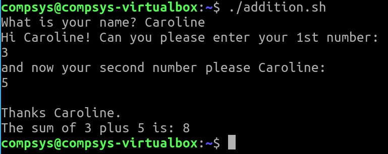
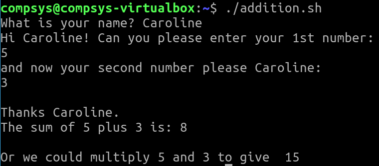

# 03. Variables

syntax · var=$(command) · echo ${var} · **expr**

```bash
#!/bin/bash
# This is a script to... 

# Display `hello`
echo 'Hello'

# Assign a variable
WORD='computer systems'

# Display that variables value
echo "$WORD"

# Demonstrate that single quotes cause variable to NOT get expanded
echo '$WORD'

# Combine the variable with hard coded text
echo "This is a welcome to $WORD"

# Alternative way to display the contents of the variable 
echo "This is a welcome to ${WORD}"

# Append text to the variable
echo "${WORD}'s module is going well"
```


# Using expr

Shell variables are untyped and are effectively treated as strings by default. 
+ expr is used for numerical calculations
+ expr is used to evaluate a given expression and display output


```bash
#!/bin/bash
# Author: your name
# Description: The following stats.sh script will ... 

x=8
y=3
z=$x+$y
echo $z
```

```bash
expr $x+$y
```

```bash
z=`expr $x + $y`
echo The sum is ${z{}
```

## read command

Read the contents of a line into a variable

+ This is a built-in command for Linux systems

EXERCISE:

1) Add further code to the script on this lab page, let's call it `addition.sh` that will add two numbers that the user inputs (making use of the expr command)

```bash
#!/bin/bash
# Author:
# Description: briefly detail purpose of script:
echo Enter your first number: 
read first
echo Enter your second number: 
read second
z=`expr $first + $second`
echo The sum is ${z}
```

## Make use of **\n** newline character

2) Format the output to be more user friendly i.e.

Add some new lines to any output using **\n** 

```bash
echo -e "\nThanks "$yourname" (and here was me thinking you were $(whoami)). \nThe sum of" $first "plus" $second "is:" $ans
``` 


3) Add to this script, code to multiply the two numbers that were input by the user.



## REVIEW **numEmp** file


TIPS Be confident in your use of:

+ backticks for the **\`date\`** command,
+ syntax **varName=$(commands)** for counting the lines in a file such as **employee.txt**
+ expand the variable in your **echo** command using the **${varName}** syntax


