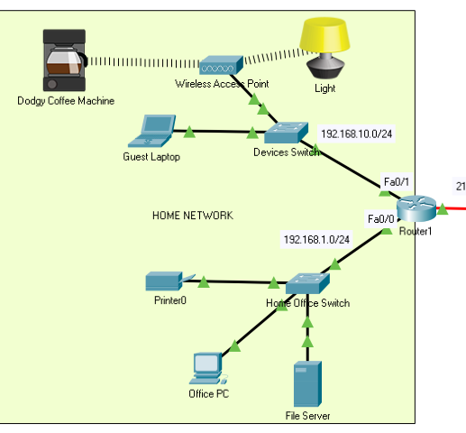

# Complete Network Documentation

**Note**: You will only need to configure **Router 1** and some of the devices in the Home Network. **Router2 and  the  devices connected to it are configured already**. 

| Device               | Interface       | IP Address                                           | Subnet Mask         | Default Gateway    |
| -------------------- | --------------- | ---------------------------------------------------- | ------------------- | ------------------ |
| Router1              | FastEthernet0/0 | 192.168.1.1                                          | 255.255.255.0       | N/A                |
| Router1              | FastEthernet1/0 | 192.168.10.1                                         | 255.255.255.0       | N/A                |
| Router1              | Serial0/2       | 211.160.200.105                                      | 255.255.255.252     | N/A                |
| Guest Laptop         | FastEthernet0   | 192.168.10.3                                         | 255.255.255.0       | ***192.168.10.1*** |
| Dodgy Coffee Machine | Wireless0       | 192.168.10.100                                       | 255.255.255.0       | 192.168.10.1       |
| Light                | Wireless0       | 192.168.10.101                                       | 255.255.255.0       | 192.168.10.1       |
| Office Printer       | FastEthernet0   | 192.168.1.3                                          | ***255.255.255.0*** | 192.168.1.1        |
| Office PC            | FastEthernet0   | 192.168.1.2                                          | ***255.255.255.0*** | ***192.168.1.1***  |
| File Server          | FastEthernet0   | ***192.168.1.5***   (or any other available address) | ***255.255.255.0*** | ***192.168.1.1***  |

Using the Logical Network View in Packet Tracer and data in the above table, answer the following questions and complete the missing information (indicated by the ???) ***ANSWERS ARE IN ITALIC BOLD IN THE ABOVE TABLE***

+ What is the Default Gateway for Guest Laptop
+ What is the subnet mask and Default Gateway for Office PC
+ What is the subnet mask for Office Printer
+ Suggest a valid IP address, Subnet Mask and Default Gateway for the File Server

