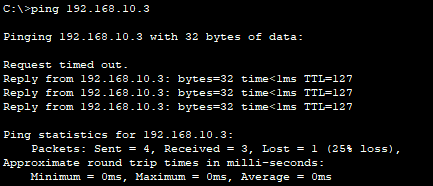

# Troubleshooting the Network

You can verify the network using a  simple list of connectivity tests. Use the following tests to verify local connectivity and internetwork connectivity . Isolate any access issues. Use the Network Table or the Packet Tracer file to get the IP addresses and check/fix any problems you find

Testing and Verification Documentation

| Test                         | Successful? | Issues                                    | Solution                                                     | Verified |
| ---------------------------- | ----------- | ----------------------------------------- | ------------------------------------------------------------ | -------- |
| Office PC to Printer         | Yes         |                                           |                                                              |          |
| Office PC to Router1         | Yes         |                                           |                                                              |          |
| FileServer to Router 1       | No          | FastEthernet0 interface is not configured | Configure using Network config table (*192.168.1.5/24*) THIS MIGHT BE DIFFERENT IN YOUR SOLUTION | Yes      |
| Office PC to Guest PC/LAPTOP | Yes         |                                           |                                                              |          |
|                              |             |                                           |                                                              |          |

PS. When you initially configure an interface, the 1st ping attempt might fail. This is probably due to how **ARP (Address Resolution Protocol)** works. If the sending device hasn’t communicated with it's default gateway, it may need to perform an ARP lookup to find the MAC address of the default gateway. Also, the Router need to perform an ARP request to find the destination device too.  This delay could lead to the first ping timing out. 

