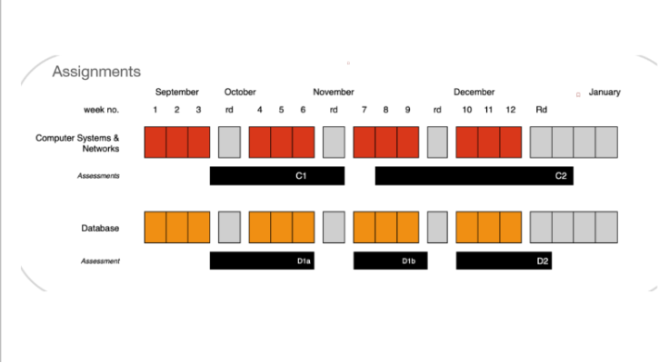

# Assessment Specification

20% CA Spec · Submission · Tips

# Specification

**Download** the [Assessment Specification file](./archives/archive.zip)

# Due Date

The completed Assessment files are to be uploaded to Moodle before Sunday 2nd November 2025, 21:00 PM
 

# What Do I Need to Upload?

(1) COMPRESSED FILES

- you are required to compress all of your files. Please upload to the associated **20% Linux Shell Scripting Assessment** Moodle upload area

(2) Link to your <10 minute Video Presentation 

In this video, you should do a ***full run through*** of each of your menu options to show their execution.

+ Begin with running the `tree` command to demo your file list

+ Split your screen so your code is visible on one half of the demo screen and you executing your code is visible on the other half of your screen

+ You should briefly describe the main coding and aproaches as you demo your work i.e. “I used an exit code here to ensure that…”, “I choose to use awk here because…” etc.

+ You can present the files using a screencasting software of your choice that allows you to record your screen plus voice audio (optional) For example Screencast-O-Matic, Kazam, SimpleScreenRecorder, Vokoscreen, OBS etc.