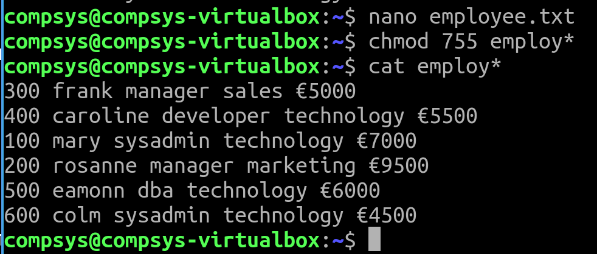

# File Manipulation

File Management · IO Redirection · Search & Filter text

# Objectives

On successful completion, you should have a good insite into working with new files and directories and manipulation of their content

Use in conjunction with the contents from Chapter8 Cisco NetAcad:

Chapter 8 covers:
- Globbing
- Copying Files
- Moving Files
- Creating Files
- Removing Files and 
- Creating Directories

# EXERCISE for this Lab

Create a space separated file called `employee.txt` that contains the following records (below is the barebones script)

- Don't forget to remember your `template` to get started!

