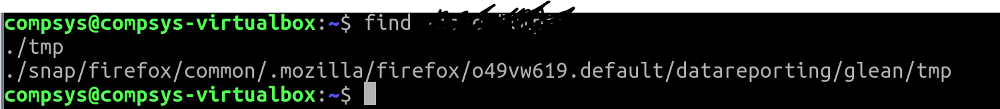

# 01. Wildcards

Glob Characters · find

## Glob characters Usage

+ The `*` character
+ The `?` character

The asterisk and question mark could also be used together to look for all files with three-letter extensions:

```bash
$ echo /etc/*.???
```

+  The `[ ]` characters

Brackets can also be used to a represent a range of characters or numbers by using the minus (**-**) character

```bash
$ echo /etc/[a-d]*
$ echo /etc/[4-6]*```
```

+ The **!** character

```bash
$ echo /etc/[!a-c]* # does NOT begin with a, b or c
```

## EXERCISE: Using **find**

The **find** command is a file search utility (Search for files in a directory hierarchy​). 

```bash
$ find ./Desktop -name "comp*" #command
./Desktop/computer.desktop #output
```
- Write the command to find and return all files whose name begins with **tmp**

A possible output when you add the correct command is:

