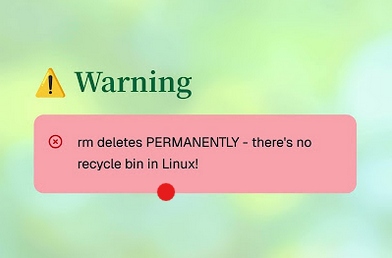

# 02. Copy Move Remove

Copy · Move · Remove

## Copy Using **cp** command

- Have a look inside the **/etc/** directory
- Copy this **/etc/hosts** file to your home directory

```bash
cp /etc/hosts ~   # Recall the ~ sign     
``` 
- check it's copied HOW?? ANS: Use the ___ command

## Verbose Mode **cp -v**

Use the **-v** flag to confirm the success of the actions:

```bash
cp -v /etc/hosts ~/tmp                                    
``` 
- If you don't use -v, the cp command will copy the files silently (i.e., no output if successful).

## EXERCISES using **cp**

Make another copy inside your **~/tmp** directory, returning the success of the action:

```bash
cp -v <<source>> <<destination>>                                    
``` 
 
Think about what are the actions of the following:

```bash
cp -v /etc/hosts ~/tmp/info                                     
``` 

```bash
cp -vi /etc/hosts ~/tmp/info                                     
```

```bash
cp -vir ~/tmp/ ~/ # Recall these optional argument meanings
deletethis                                    
```

## Move / Rename using **mv**

What is the action of the following:

```bash
mv ~/deletethis  ~/tmp/                                  
```

## View files using **tree**

Try these out:

```bash
$tree
$tree -a Desktop
$tree D*
$tree d*
$tree ????
$tree t*
$tree t??
``` 

## Remove files using **rm**

Once a file is deleted with rm, it cannot be easily recovered



 Try out:
 ```bash
 rm ~/tmp/deletethis
 ``` 

+ Check the **deletethis** directory has been removed  
 
+ Copy your **employee.txt** file into your **Assessment1Files** directory