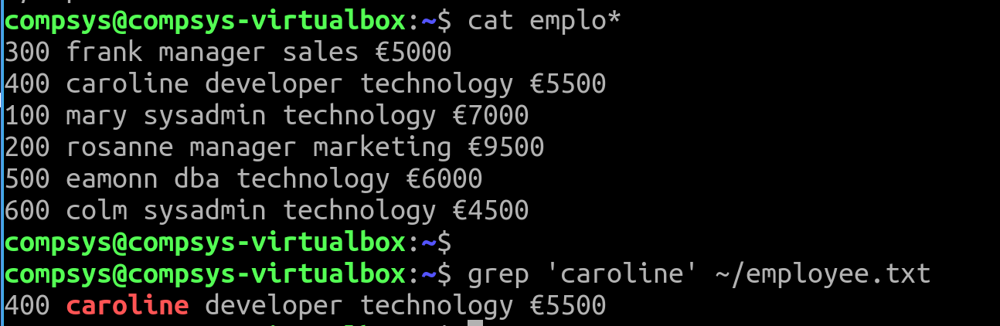

# 02. grep

grep

Using regular expressions with **grep**

**Regular Expressions** are a powerful means for pattern matching and string parsing

Regex can be used in a variety of programs like grep, sed, vi, bash, rename and many more

## **grep**

Add (append) these records to your **employee.txt** file


Syntax for using grep:

```bash
$ grep Catherine employee.txt 
```

+ Add **-n** to see the line **n**umber 
+ Add **-v** in**v**ert
+ Add **-i** to **i**gnore-case 

```bash
$ grep -nvi search_term filename 
```


## Pipe Symbol | as a Logical "OR"

The **pipe (|)** symbol is used as a logical OR to signify one or the other

```bash
$ grep 'Catherine|Katherine' employee.txt
```

## grep -E (is preferential to egrep)

But now you're not seeing any result? 

+ You might need to indicate to the shell you wish to use grep -E because, while using basic regex, all characters are treated as regular characters:

So would need to use the backslash to escape characters

```bash
$ grep -E 'Catherine|Katherine' employee.txt 
#streamline it:
$ grep -E '(C|K)atherine' employee.txt 
#special chars are treated as they should be:
$ grep -EiC 0 '(C|K)atherine' employee.txt 
#add -C 0
$ grep -EiC 1 '(C|K)atherine' employee.txt 
#add -C 1 to see an additional line before and after the search term
```

## The . character

Matches **any** character 

Recall your `employee.txt` file



TRY OUT:
```bash
$ grep 'm.....' employee.txt
```

REFINE:
- The pattern **m.....r** would find any line that contained the letter **m** followed by exactly five characters and then the letter **r**

```bash
$ grep 'm.....r' employee.txt
```

## The [ ] characters

...match a single character from the list or range: 

```bash
$ grep '[2-3]' employee.txt
$ grep '[^2-3]' employee.txt
```

Can you see the difference in the colour coded output?

## The star \* character

...match zero or more occurrences

```bash
$ grep 'm[ao]*' employee.txt
```
And what about:

```bash
$ grep 'ma[ao]*' employee.txt
```

## ^ to search the beginning of the line

```bash
$ grep '^.00' employee.txt
```

## $ to search the end of the line

```bash
$ grep '.00$' employee.txt
```


# The Escape \ character

Any of the special characters can be matched as a regular character by escaping them with a \ (backslash)

+ What if you wanted to search for currency i.e. the **$** dollar sign?

Edit your employee.txt file to include the following sentence:

```bash
$ echo "There are no $ currency, only €" >> employee.txt
$ cat empl*
```

+ $ is a special character meaning search at the end of a line:

```bash
$ grep '$' employee.txt # what does this return
```

and now try:

```bash
$ grep '\$' employee.txt # spot the difference
```

## EXERCISES: 

+ Assume you wish to write a script called **numEmp**


How could you improve on this to:

- Match all lines that start with **cat**

- Match all lines that end with **cat**

- Match all lines that contain any of the letters ‘a’, ‘b’ or ‘c’

- Match all lines that do not contain a vowel

- Match all lines that start with a digit following zero or more spaces

- Match all lines that contain the word hello in upper-case or lower-case

- **$ grep “\$\*” file1** will match the lines that contain  ___________at the _______ of the line

