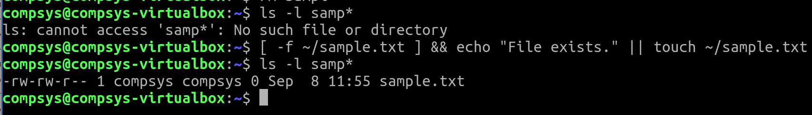

# 01. Conditionals

test · if

# Command Chaining

## Combining Multiple Operators

It can be convenient at the beginning of execution to **check if a particular file exists** and create if not.

Here's the steps:

1. first check if a file **sample.txt** exists in your home directory (try make use of **[ -f filename]** instead of the **[ -d filename]** used above)
2. if it exists, print a message to STDOUT (**echo “File exists.”** ). 
3. If not, create the file ( **touch ~/sample.txt** )



# **test** statement

Often used to testing verifying conditions, including:
- Variable contents
- File access permissions
- File types

```bash
test 10 -gt 55; echo $0 # return exit status (default 0=success; 1=failure )
```

This exit code can be customised:

```bash
test 56 -gt 55 && echo true || echo false
```

More commonly used with **[ ]**

```bash
[ 56 -gt 55 ] && echo true || echo false
```

and it can be combined with logical **AND** and **OR**

```bash
[ 56 -gt 55 -a 45 -lt 90 ] && echo true || echo false
[ 56 -gt 55 -o 45 -lt 90 ] && echo true || echo false
```

# **if** statement

1) Make a backup of **employee.txt** called **employee.bak**

```bash
cp employee.txt employee.bak
```

2) Write a script **rmOld** which checks if an old temporary file exists called **employee.bak** and if so, then delete this

HINT: **-a filename** or **-e filename** will check if **filename** exists. 

```bash
if [ -a employee.bak ]; then
rm -f employee.bak
fi
```

3) If **/.bashrc** is a regular file (use the **-f** option) and reply to the user "Hello username. You’ve checked a regular file"

```bash
if [ -f ~/.bashrc ]; then #`-f` checks 
echo "Hello $USER, You've checked a regular file"
fi
```
