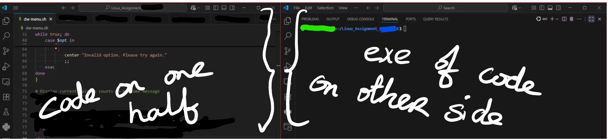

# 5% Homework

HOMEWORK: Filtering your script

# Solution to Print only the last column of the **/etc/shells** file

```bash
awk '{print $NF}' /etc/shells | uniq
```

-  pipe this whole command into the `uniq` command to ensure duplicates are removed 
- pipe this unique list into the `sort` command

# 5% HOMEWORK

Following on from the exercise in your previous class (*Add new records* to *employee.txt*): 

1. With the aid of **grep** and **awk**, create a script that will ask the user to choose any persons name from your **employee.txt** file. 
2. The system is to return the name of said employee along with their associated expenses (i.e. the value in the last column of that txt file)

When writing your script, consider:

 + the user may need an option to **add** a new user to the system
 
 + the user may need an option to **view** the file to see the names in the system before searching for their expenses 

+ search terms should be **case insensitive** 

+ the user should be able to exit the script at any time

+ the system should be end-user friendly i.e. simple yet easy to read and understand the options presented and their expected outputs

+ Include your name as **Author:** in the script header as well as a brief **Description:** of your script (RECALL: your script template)

Are there any other error handling or other considerations you would like to implement?

*This screenshot might be similar to a FIRST DRAFT output of your script* 


Upload the following to Moodle (once I have the upload area open):

(1) your code (this is to be a simple text file) plus

(2)  a brief video recording (2 minutes'ish) of your working script

    Demo your code on one half of the screen and the code execution on the other half of the screen, similar to:



## RECORDING GUIDELINES:

Use any screen recording software:

i. demo the menu options presented to the user 

ii. show all records in your system 
(maybe you've included a **view records** option?)

iii. demo adding a new record being added & stored to your system (maybe through a **Add New Record** menu option?)

iv. again, view all records in your system where the new record should now be also present (maybe re-use **view records** option?)

v. demo exiting the system via suitably named option

## CA Due Date:

- Please aim to upload the end of the first reading week (Sunday Feb 15th 9pm)

- Value: 5% of your CA

**GRADING RUBRIC**

- 1% User experience (easy to understand & use)
- 2% completed working code
- 1% good coding layout (expected shebang, author, desc lines; indentation, comments) & video
- 1% Error handling


