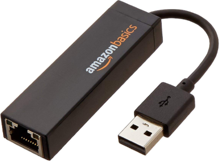
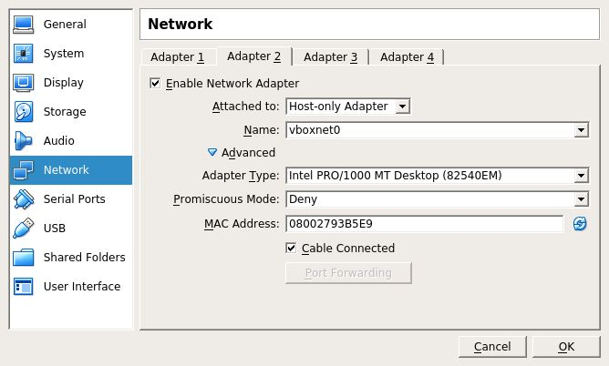
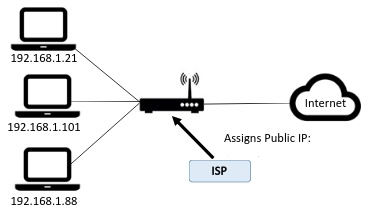
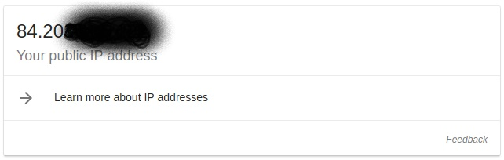

# Network Adapter

## Introduction

You will now investigate your home network setup. Not only is it a good idea to know how you connect to the local network in your home, but also what internet service provider you use, what's the maximum upload and download speed you can achieve, what IP address you have on the internet and what network interfaces you have on your machine. It may be useful to know these details if you need to troubleshoot connectivity and network issues in later labs.  

## Your "Internet Connection"

You are likely to be using one of the following systems to connect to the internet in your home:

+ DSL/Fiber wired connection with a home router using an Internet Service Provider (e.g. Eir)
+ Mobile Broadband router (sometimes known as a 'hotspot') provided by a mobile network provider (e.g. [Vodafone](https://n.vodafone.ie/shop/broadband/mobile-broadband.html)).
+ 3rd party wireless provider or general apartment complex broadband connection.

Most solutions will require that you have some form of physical device that can route network traffic from your home network and the internet (usually called **Router**). You can then connect your devices to the router and you're up and running! Every device that you connect to the network must have a suitable network adapter.

## Network Adapter

A Network Adapter, also called a "network interface card" (NIC), is the interconnection point between a device and a network. On your laptop or computer (host), the network adapter is typically built in. However, the adapter does not need to be a physical thing. A network adapter can be implemented in software. For example, the loopback interface (127.0.0.1 for IPv4) is not a physical device but a piece of software simulating a network interface. Similarly, in Virtual Box(or on any virtualised device), you can configure "virtual" network adapters for you Virtual Machines.

On your computer (host), the network set up will look different depending on various factors such as how you connect (wired, wifi) and how many network adapters you have on your computer. More than likely, you have at least 2; Ethernet(wired) and/or Wireless LAN (wifi).

1. Using the applicable command, find the and copy the full description of the network adapter on your host that's being used currently to connect to the LAN network. 
   On windows, enter ``ipconfig -all`` 
   On linux/mac, use ``ifconfig``  
   

You can usually tell which one is routing traffic to/from your LAN (and internet) by examining the IP settings and finding the entry that has the **default gateway set to the IP address of your router**.

# Exercises:

Explore the network config of your Machine and answer the following questions:

## Loopback
1. What is a "loopback" adapter?
2. What is the IP address for the Loopback adapter?
3. Give one use for the loopback adapter?

## Network Adapter
1. What's the name and IP address of your VMs network adapter?

2. How was the IP address assigned to the network adapter?

   

## Private and Public IP addresses

  

You now know the IP address of your machine on your local area network(LAN). However, this is probably a "local" IP address that is just used in your LAN. It is not the IP address that the rest of the internet uses to interact with your computer. Your internet service provider will assign a single public IP address that is used by your computer (and all other devices on your LAN) and your router can translate traffic between local and public IP addresses. There are several  web services that can be used to find out your public IP address.  
+ In a browser, go to [Google](www.google.ie) and search "what is my IP". You’ll see the Public IP address of your computer.  
  

**NEVER TELL ANYBODY OR EXPOSE YOUR PUBLIC IP ADDRESS.** Your public address can be used to probe and attack your home network. 

IP addresses are managed by the Internet Assigned Numbers Authority (IANA), which has overall responsibility for the Internet Protocol (IP) address pool. 
Your public IP address is usually based on a real-world location and can be used to estimate where you are. For example, your IP address can be used to give you weather forecasts for the town you're in or to advertise local services in the area. 
