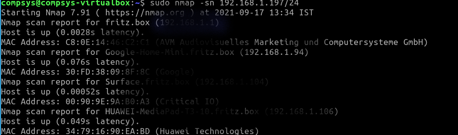

# Scan your LAN?

**nmap** (Network Mapper) is an open-source tool for network discovery and auditing. It's available for Linux, macOS, and Windows. You can use NMap to better understand what's happening in your network. We are using a small portion of it's capability here - more details can be found at https://nmap.org/

You will now use nmap to scan your home LAN and list all connected devices. 

**NOTE: This might not work too well if you're doing this in an office or public wifi network**

## Subnet Address

To use **nmap** to scan the devices on your network, you need to know the *subnet* you are connected to (don't worry, we will discuss subnets later - they're great!). 

Previously in this lab, you learned how to get the IP config of your machine. Using this, you can work out the subnet address of the network, which is typically the first 3 numbers of the IP address followed by a 0 on a home network. For example, if your IP address is 192.168.1.100, other devices,such as smart TV will be at addresses like 192.168.1.101, 192.168.1.34, 192.168.1.4, etc. and the subnet address would be *192.168.1.0*.   

## Scan the Subnet
+ In a terminal window on your host, use the `nmap` command with the -`sn` flag (ping scan) on the whole subnet range. This may take a few seconds:  
~~~bash
sudo nmap -sn 192.168.1.0/24
~~~
***Note: The ``192.168.1`` part in the command above should be replaced by the first 3 parts of your VMs IP address.***

The scan will "ping" all the IP addresses to see if they respond. For each device that responds to the ping, the output shows the hostname and IP address as follows:
  
Examine the list. It should contain the machine you're working on, the router your connected and things like your Smart TVs and other connected devices in your home. Hopefully you recognise all devices on your list. If you don't, it might be worth while having a closer look at them. 

## Operating Systems

You can use NMap to try to detect what Operating system is running on the connect devices in a network. 

+ At the command line, enter the following(again, you may need to change the IP address to match your network):

``sudo nmap -O 192.168.1.0/24``

You should see something similar to the following:  

Knowing the OS, IP address and device type can be used to do an audit on your network, perhaps to locate devices that could be vulnerable to hacking /attacks. 

