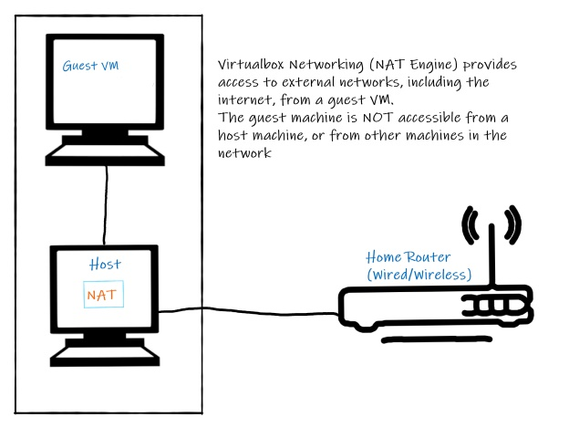
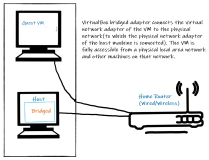

# Appendix

If you are using Virtualbox/Ubuntu, you can set it up to connect to your LAN using a bridged adapter.

You can set up your VM to contain all the software you need for the networking part of the module.

## Virtual Machine Network Adapter

By default, the Virtual Box hypervisor is providing a NAT (Network Address Translation)-based network adapter for you Guest Virtual Machine. 

NAT essentially provides a mechanism to connect your guest VM to the Internet via the Host's Network Adapter. However, this means the guest VM does not have direct access to the host's Network(ie your home network). This worked fine up to now. However, to facilitate more advanced networking, we would like your guest VM to "appear" like any other device on your home network, even though it's a Virtual Machine. To do this, we will use a **bridged adapter**. Using a bridged adapter, Virtual Box connects the VM directly to the physical network via your hosts network adapters, circumventing your host operating system's network stack.

## Setting up a Bridged Adapter

+ Shut down the CompSys2021 VM if it's running.

+ Open Virtual Box and select the *CompSys2021* in the Virtual Box manager. Select *Settings -> Network*. For adapter 1, in the *Attached to* field, select "Bridged Adapter". The Name field should change by default to the adapter currently connected to the network (it will probably be different to what's shown in the image below).  
  

Lets check that your VM can connect to the internet by opening a terminal and access a random website. **Wget** is a command line computer program that retrieves content from web servers. 

+ Enter ``wget google.ie`` at the command line. You should see a successful response similar to the following:  
  

Notice that you used a **domain name** (eg google.ie) in the wget command. In this case, your machine would have used Domain Name System (DNS) to get the IP address for "google.ie". As you can see, in this example, the IP address returned is *74.125.193.94* and we got a successful reply so the virtual machine is connected to the internet!  
We'll cover more about DNS and IP in future coursework.
