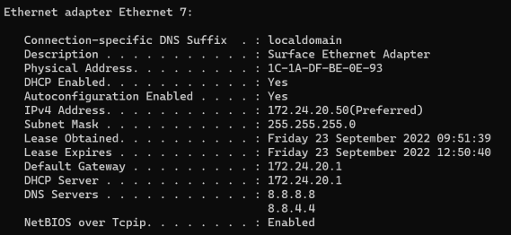
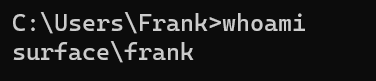
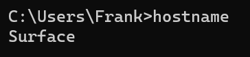
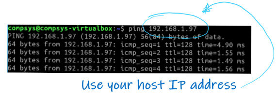
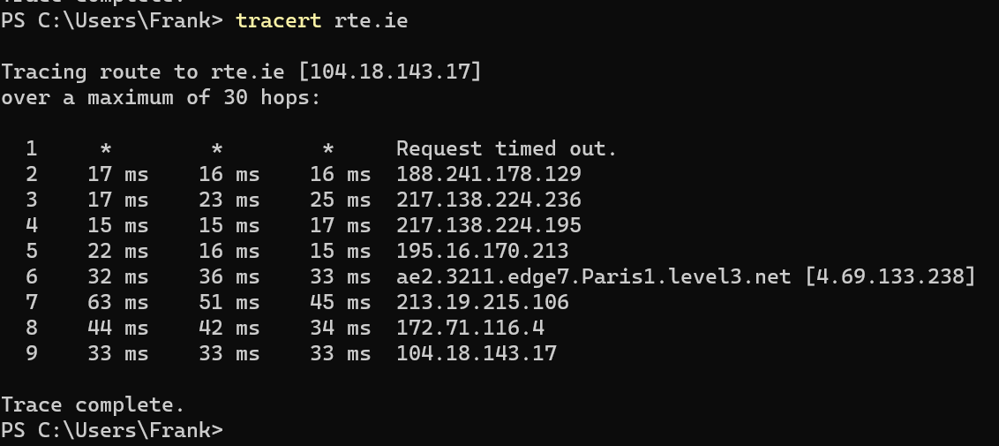

# Basic Network Config

### *& some other stuff...*

Now lets explore some terminal commands that are useful for checking basic networking configuration. 

## IP Address
You already used **``ipconfig``**(windows) and   **``ifconfig``**(Mac/Linux) to view the status of all currently active network adapters, including their names. 

Note some significant information here, specifically the Adapter names and their IP(Internet Protocol) addresses. An Internet Protocol address (IP address) is a numerical label such as 192.168.0.1 that is connected to a computer network that uses the Internet Protocol for communication.

## What's a MAC Address??

Examine the ``link/ether`` or ``Physical Address`` value for your interface. This is the **media access control address (MAC address)** and  is a unique identifier of your network interface controller (NIC) for use  in communications in your local network . MAC addresses are used is common networking technologies, including Ethernet, Wi-Fi, and Bluetooth. We will examine this more in the next lecture - for now, you just need to know that each device connected to your network has one and it never changes (unlike the IP address).

If you can't wait until the next lecture, see more here: https://www.youtube.com/watch?v=N7dM_kD28dM

## Who am I?
Just in case you forget who you are (as in what user you're currently working as on a machine) you can use the **``whoami``** command. Type **``whoami``** at the command prompt and it should let you know that you are currently logged in as the *compsys* user.  

## hostname
The hostname command lets you know what host name is being used to identify you in the network. Type **``hostname``** at the  command prompt to see the hostname of your machine. As you can see, it matches your command prompt hostname.  

## PING
PING(Packet INternet Groper) sends ECHO_REQUEST packets to the IP address you specify. It’s a handy way to see whether your machine can communicate with the Internet or another machine. However many machines are configured **not** to respond to pings so, if you don't get a response, it doesn't  mean the machine is not connected and available for communication.
Previously in this lab, you found the IP address/Default Gateway of your Host. Let's ping the Default Gateway machine (probably your home router).

- In the terminal, type **``ping ``** followed by the Default Gateway IP to see of it connects. You should see responses similar to the following:  
  

## Tracepath/Tracert
Tracepath is a network troubleshooting utility which shows the number of "hops" taken by network "packets" to reach a destination and also determine the travelling path through the network. 

+ In the SSH session, type **``tracepath www.rte.ie``** to see the path though to the RTE web site. You should see responses similar to the following:  
  

# Speed

  ***NOTE:** Carry out the following exercises on you CompSys Virtual Machine using a bridged network adapter. However, it is possible to do the same on your local host with a few changes*

There are several factors that can affect the quality of your connection and the speed of your machine. Typically, broadband speed is measured in **Megabits per second**, commonly written as ``Mb`` or ``Mbps`` (as in 24Mb or 24Mbps). It is the rate at which data is transferred either from (download) or to (upload) a location in the internet. As there are 8 bits in a byte, 1 Megabit per second (the unit internet speeds are measured in) is 8 times slower than 1 Megabyte per second.

You will now check your connection speed using ***fast-cli***, a Javascript utility that's curated on the Node Package Management platform (NPM). 

+ Open a terminal window on your CompSys2021 virtual machine(or a machine that has Node.js installed) and enter ``npx fast-cli -u`` at the command prompt to check out it's usage.  
      
+ Alternatively, you can use an online such as  https://www.speedtest.net/

So you can now compare this to what you Internet Service Provider states they can provide (usually they state something like *"up to 100Mbps"*). 

