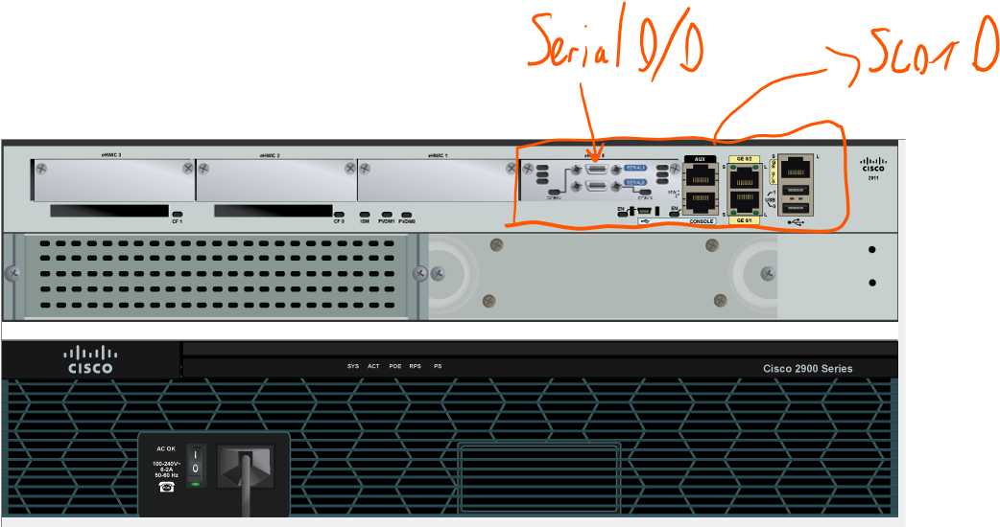

# ARP Requests

+ Start Packet Tracer.
+ Download and open the following file in Packet Tracer. This contains a pre-built Network we can use to simulate ARP network traffic (if you're viewing this lab from your host machine, right-click on link and copy/paste URL into a browser in you VM ):

[PacketTracer File](https://drive.google.com/file/d/1v8s_5A7r2avcQM6ML7nVmvCoZt0LEBPc/view?usp=sharing)

+ Open the file using Packet Tracer in your VM using *File->Open*.

Device and interface details for this network can be referenced in the following table:

NOTE: Cisco router interfaces are named with the following convention:

**Media-type slot#/#interface-card-slot/port#**

The media type can be Ethernet(E), Fast Ethernet(F), Gigabit Ethernet(G), Serial, or other media types. A 100Mb Ethernet interface is called a **FastEthernet** interface and a 1000Mb Ethernet interface is called a **Gigabit Ethernet** interface.

## Generate ARP Request

+ Click 172.16.31.2, click on the Desktop tab and open the Command Prompt. Enter the ``arp -d`` command to clear the ARP table and close a command prompt.
+ Enter Simulation mode(by clicking on  Simulation in bottom right of screen ) and `ping 172.16.31.3` on the command prompt. Two PDUs will be generated. The ping command cannot complete the ICMP packet without knowing the MAC address of the destination. So the computer sends an ARP broadcast frame to find the MAC address of the destination.
+ Click Capture/Forward once. The ARP PDU moves Switch1 while the ICMP PDU disappears, waiting for the ARP reply. Open the PDU and record the destination MAC address.  

+ Click Capture/Forward once. The ARP PDU moves Switch1 while the ICMP PDU disappears, waiting for the ARP reply. 
+ Open the ARP PDU by selecting it in the simulation pane. This will open the *PDU Pane*. Find and record the destination MAC address by clicking on the *Outbound PDU* tab.  

+ Click Capture/Forward to move the PDU to the next device.  
  **Question**: How many copies of the PDU did *Switch1* make? What is the IP address of the device that accepted the PDU?

+ Open the accepted PDU by clicking on it in the logical workspace. Examine Layer 2(data Link)  of the *Outbound Response*.  
  **Question**: What happened to the source and destination MAC addresses?

+ Click Capture/Forward again to move the ARP reply through Switch1 and on to 172.16.31.2.  
  **Question**: How many copies of the PDU did the switch make during the ARP reply? Why?

## Examine the ARP Table

+ Note that the ICMP packet reappears. Open the PDU and examine the MAC addresses.  
  **Question**: Do the MAC addresses of the source and destination align with their IP addresses?
+ Switch back to Realtime by clicking on *Real Time* button. The original ping will complete
+ Click 172.16.31.2, open a command window and enter the ``arp –a`` command. This will display the ARP Table for this host.  
  **Question**: To what IP address does the MAC address entry correspond?
