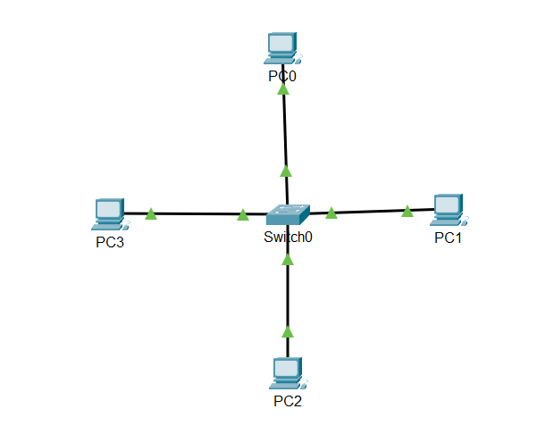
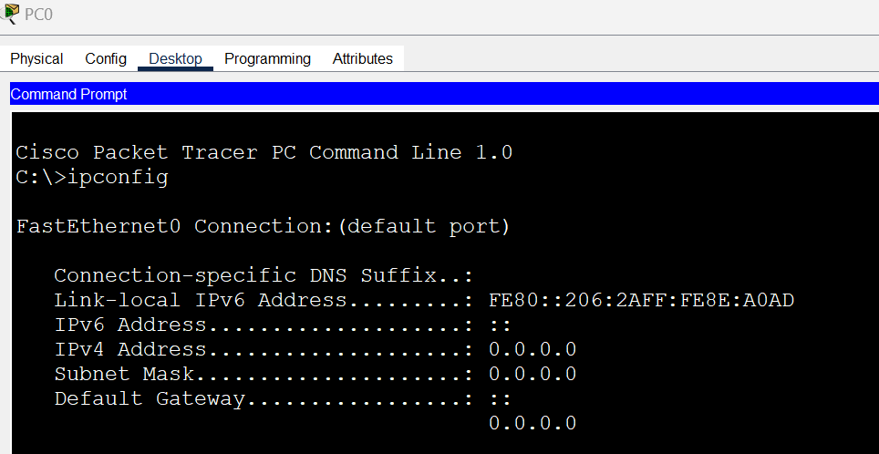
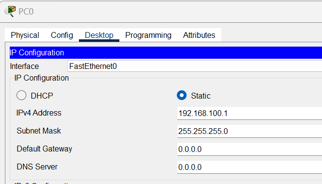
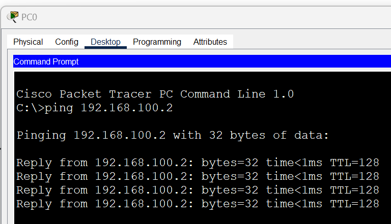
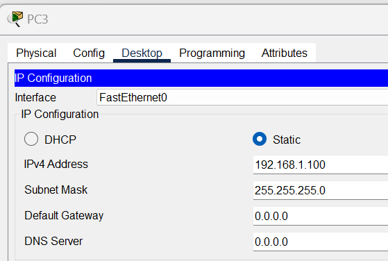
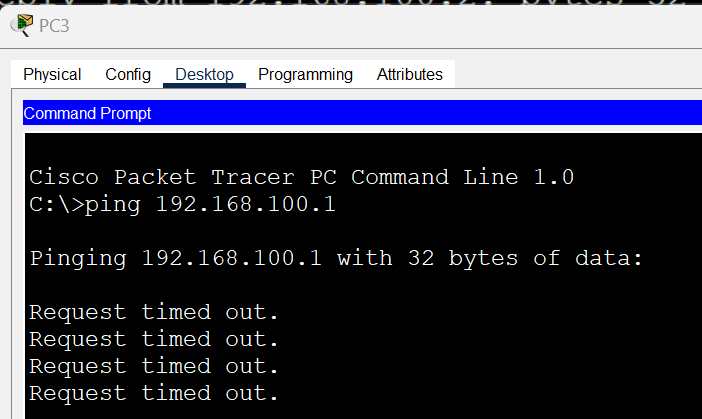

# Static IP Network Config

In this exercise, you will configure a small IP network using a switch and 4 hosts as shown below: 

You will use **"Ping"**, a network diagnostic tool that is used to test the reachability of a host on an Internet Protocol (IP) network. It also measures  the round-trip time for messages sent from the originating host to a destination host. 

### Check IP Configuration

+ Open the Packet Tracer file contained in the [**IP Network Packet Tracer**](https://setu-hdip-comp-sci-2024-comp-sys.netlify.app/topic-05-week5/unit-2/archive-ip-network/archive.zip) Archive in IP Networking unit in Week5.
+ Click on **PC0** and select the "**Desktop**" and open the command prompt. 
+ Enter ipconfig at the command prompt to see the current IP configuration.
  

+ As you see, the FastEthernet0 connection is not configured with an IP address. We are now going to set up a small network by assigning static IP addresses to each host. See the following for the Network design details:

### IP Network Configuration

**Network Address:** 192.168.100.0/24

**Number of host addresses:** ? (please calculate this!)

**Broadcast Address:** ? (please calculate this too!)

**PC0**: 192.168.100.1/24

**PC1**: 192.168.100.2/24

**PC2:** 192.168.100.3/24

+ In PacketTracer, select **PC0,** close the command prompt if it's still open. In the **Desktop** tab, select IP Configuration and enter the following:
  
  Leave Default Gateway and DNS Server - we only wish to set up a local network with no external connection so we do not need to set these for now.

+ Repeat the process and assign the correct IP address **PC1** and **PC2**.

+ Return to PC0 and open a command prompt. Check you can ping PC1 and PC2 from PC0:

  

  You should get a successful reply, indicating that hosts can now communicate successfully. 

## PC3

+ Double click on **PC3** and open the Desktop. Select IP configuration and assign a static IP address of **192.168.1.100** and a subnet mask **255.255.255.0**.
  

+ Now, open a command prompt on PC. You should see the following

  

+ Similarly, open a command prompt on PC0 and try to ping PC3 (192.168.1.100). You should see the same result.

### Exercise

Have a look at the IP config of PC3. Why can you not ping/connect to PC0 (or PC1/PC2 for that matter)? Try to diagnose the problem.
What change could you make to the IP configuration on PC3 to successfully connect(ping)  the other hosts on the network?