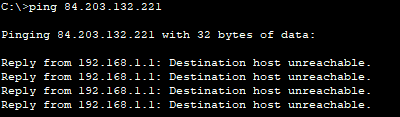
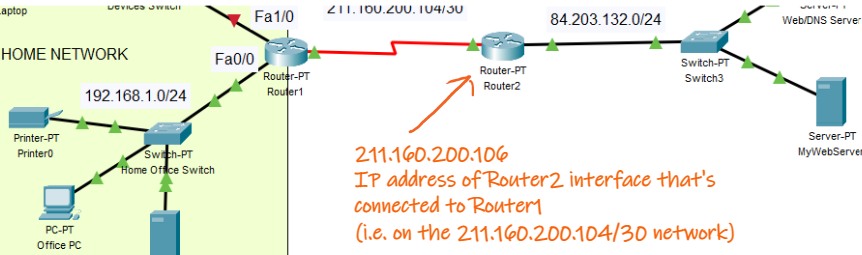
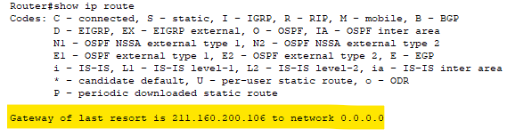
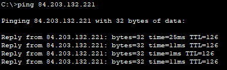

## Check Router1 Configuration

Open the [Starter Packet Tracer](https://drive.google.com/file/d/1LTb4RRbKx0tE_KrXIE-QPvpz3JOiN9cR/view?usp=sharing) file.

### Interface information on Router1.

You will now use IOS to configure Router1. 

+ Click Router1 and then click the **CLI** tab to access the IOS command line directly. (alternatively you can connect to the console port on Router1 like we did in the last lab) 

Use the last lab(Switch Configuration) and lecture notes to complete the following:

+ Set the **hostname** to Router1.
+ Set the the **console** password to **compsys** and  the **privileged EXEC** password to **ilikecake**. Ensure that the passwords are encrypted.
+ Display the information about the **Serial2/0** interface only(hint: use ``show interface serial2/0`` in user EXEC mode)
  +  What is the IP address configured on serial2/0?
  +  What is the bandwidth on the Serial2/0 interface?
+ Using the same approach, enter the commands to display the statistics for the FastEthernet0/0 interface and answer the following questions:
  + Is there an IP address assigned to it?
  + What is the MAC address of the FastEthernet0/0 interface?
  + What is the bandwidth (BW) of the FastEthernet0/0 interface?

### Display a summary of the interfaces on Router 1.

Use the command to display a brief summary of the current interfaces, interface status, and the IP addresses assigned to them.

+ How many Serial interfaces are there on Router1?
+ How many Ethernet interfaces are there on Router1?


### Display the routing table on Router 1.

+ Enter the command on **Router1** to display the routing table and answer the following questions:

  + How many connected routes are there (uses the **C** code)?

  + What is the static route defined in the router (uses the **S** code)?
  + How does a router currently handle a packet destined for a network that is not listed in the routing table?


## Configure Router Interfaces

### Configure the FastEthernet 0/0 interface on Router1.

+ Enter Global Config mode and enter the following commands to address and activate the FastEthernet 0/0 interface on **Router1**:


```
Router1(config)# interface fastethernet 0/0

Router1(config-if)# ip address 192.168.1.1 255.255.255.0

Router1(config-if)# no shutdown
```


It is good practice to configure a description for each interface to help document the network. Configure an interface description that indicates the device to which it is connected. 

```
Router1(config-if)# description LAN connection to Home Office Switch
```

### Configure the remaining Ethernet Interface on Router1

Use the information in the Addressing Table to finish the interface configurations for **Router1**:

+ Enter the IP address and activate the interface.
+ Configure an appropriate description.
+ Verify interface configurations.


### End Device Configuration (Office PC)

The office PC has not been configured with an IP address, default gateway, or DNS yet.

+ Select the Office PC, go to the Desktop tab and select IP configuration. 

+ Enter the values from the Network Documentation table completed in the last step. Use 84.203.132.220 for the DNS Server. 

  

+ Ping the default gateway to check the configuration is working.

## Validate connectivity

**Office PC** should now be able to ping the router interface. 

+ On Office PC, ping the router/default gateway

```
ping 192.168.1.1
```


## Update Routing Table - Gateway of Last Resort

You will now check the connectivity to external networks.

+ On Office PC, ping MyWebServer on the 84.203.132.0/24 network. MyWebServer IP Address is 84.203.132.221




Notice that the ping fails - the reply from the router indicates that the destination is unreachable. This is because there is no entry in the routing table for the 84.203.132.0/24 network **or** no Gateway of Last Resort. The Router will drop the packet. 

To fix this, we can update the Routing Table to send all traffic not destined for directly connected networks to Router2 as the "next hop". We can do ths by setting the Gateway of Last Resort to the Router2 interface that is connected to Router1.



+ Enter **global configuration** mode on Router1 and add the following static route to set the gateway of last resort to "next hop" address 211.160.200.106.

````
Router1(config)#ip route 0.0.0.0 0.0.0.0 211.160.200.106
````

Note: 0.0.0.0 is a way to specify "any IP address/subnet mask at all".

+ Now check your routing table as before and confirm the Gateway of Last Resort is set.

  

+ Finally, on **Office PC**, try to ping MyWebServer again. The Router should now successfully route traffic to the  84.203.132.0/24 network(the .




## Verify the Configuration

### Use verification commands to check your interface configurations.

Use the **show ip interface brief** command on **Router1** to quickly verify that the interfaces are configured with the correct IP address and are active.

Answer the following Questions

+ How many interfaces on **Router1**  are configured with IP addresses and in the “up” state?

Use the **show ip route** command on both **Router1** to view the current routing tables. 
Answer the following questions:

+ How many connected routes (uses the **C** code) do you see on each router?
+ Examine the Static route (indicated by the **S**) in the table:
  + What network does it route for?
  + What's the "next hop" address?


### Back up the configurations to NVRAM.

As with a switch, you need to save the running configuration to the start up configuration 

+ Save the configuration file on Router1 to NVRAM. Use the same command/process you used when configuring the switch in the last lab(``copy running-config startup-config``).

