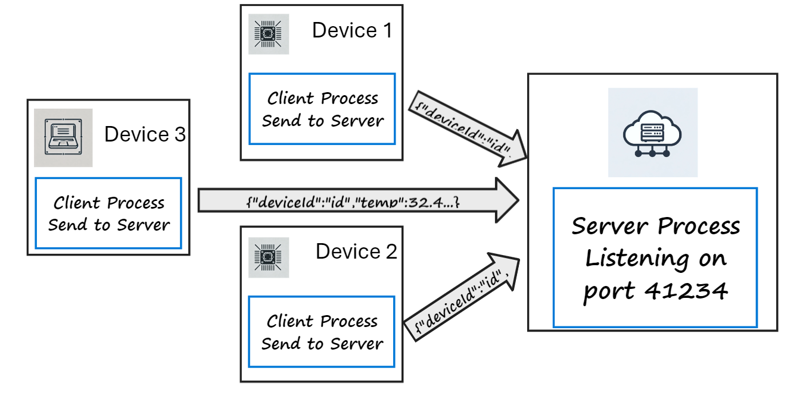

# UDP/TCP and Sockets

This lab explores transport layer protocols, UDP and TCP.

## Lab Objectives

+ Generate UDP/TCP network traffic.
+ Use Wireshark to filter and record UDP/TCP traffic.
+ Analyse recorded data and observe protocol features.
+ Implement clients to connect to remote TCP/UDP socket server.
+ Observe and understand UDP datagrams/TCP segments.

## Introduction

In this lab you will implement communication for a prototype *Smart Environment* communication scenario. Similar systems are used in domestic, commercial and industrial domains. Applications  include energy monitoring & efficiency, climate control, frozen pipe/weather damage prevention.

For an example of a real product in this space, check out the following video: ([https://youtu.be/VvMSufOXWz4](https://youtu.be/VvMSufOXWz4))

## Prerequisites

As you progress, it is beneficial to integrate knowledge and skills from different strands of the course. In this lab, you will be using concepts from earlier computer systems topics such as scripting and command-line usage, alongside skills from Web Development 2, including Node.js, JavaScript, and JSON.

### Scenario

Let’s assume we're prototyping the communication function of a smart environment infrastructure for monitoring temperature and humidity at several locations (in this case, our prototype sensor device will be a simulated device).

+ The sensor device sends data messages to a process on the **Server Host** that processes the data and stores it for analysis. 
+ Each device can be configured to send the data at a specific interval(e.g. every 5 seconds). 

### Data Messages

The data sent by the sensor devices (in this case  will take the following JavaScript Object Notation (JSON) format shown in the following example:

 `{"deviceID": "Device1", "temp": 36.32, "humidity": 37.44}`

We are sending 3 data items here:

+ **deviceID:** The unique ID of the device (remember we could have many devices)
+ **temp:** Temperature in C
+ **humidity:** The relative humidity

### Device Configuration

The following configuration parameters will be used on each device to send sensor data  to the server

+ **IP Address** of Server host
+ Server process **Port Number** (we need this in the transport layer)
+ A unique **DeviceID** to be included in the data messages(your student ID)
+ Transmission interval: the time, in seconds, between each transmission

### Scope

In this lab, we will investigate using UDP and TCP as the transport protocol for data message transmission between the sensor devices and server.
