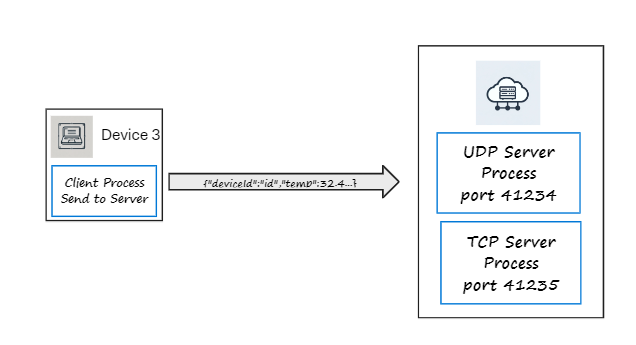

## Lab Setup

This lab is based on two  programs -  a simple Server Process and Client Process. You will implement a subset of the diagram on the previous page,  with just one *"simulated"* sensor device(on your Laptop/workstation) and Server Process hosted in the cloud(an already deployed cloud process) as shown in the diagram below. The client process will run on your machine, and the server process is already running on the Cloud-based host.

The Server process is running on a host with a public IP address 172.236.14.17.

Lets check the Server host is accessible responding by pinging it's IP address. On your machine, open a terminal and ping the server:

~~~
ping 172.236.14.17

Pinging 172.236.14.17 with 32 bytes of data:
Reply from 172.236.14.17: bytes=32 time=82ms TTL=51
Reply from 172.236.14.17: bytes=32 time=62ms TTL=51
Reply from 172.236.14.17: bytes=32 time=59ms TTL=51
Reply from 172.236.14.17: bytes=32 time=63ms TTL=51

Ping statistics for 172.236.14.17:
    Packets: Sent = 4, Received = 4, Lost = 0 (0% loss),
Approximate round trip times in milli-seconds:
    Minimum = 59ms, Maximum = 82ms, Average = 66ms
~~~

If you are not getting a response from the server, it could be that server process has stopped responding or your local configuration is blocking the ICMP traffic generated by the ping command. If so, check with your class to see if anybody else is having the same issue...

