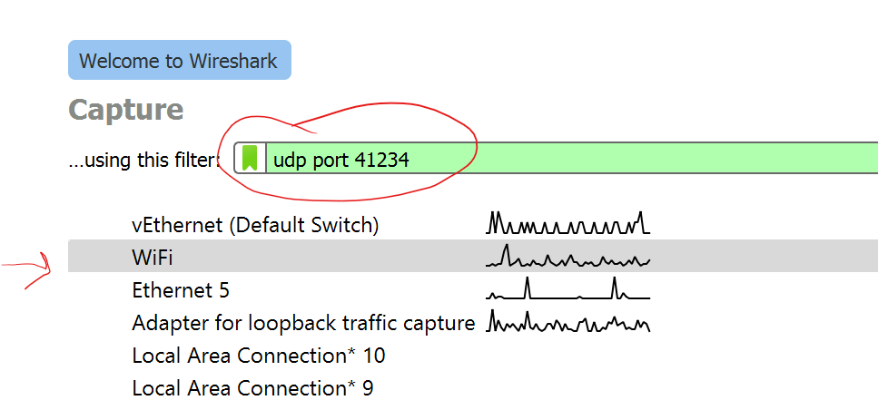
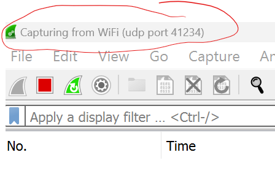
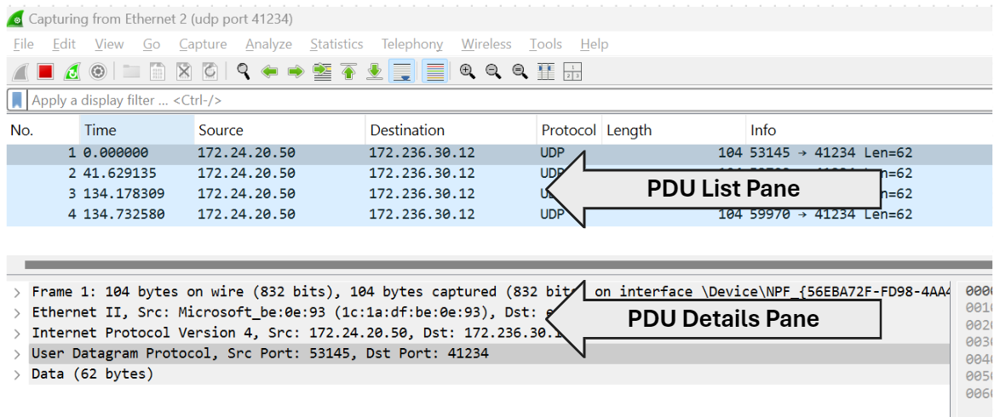

## UDP

### UDP Client - Command Line

From the [previous labs](https://tutors.dev/lab/setu-hdip-comp-sci-2024-comp-sys/topic-04-week4/unit-1/book-1-home-net/LAN%20Scan), you should already have **[Nmap](https://nmap.org/)** installed on your machine. Nmap incorporates **[Ncat](https://nmap.org/ncat/)**, which is a handy networking utility used for various network-related tasks like reading and writing data across networks. (QI, it's an enhanced version of the classic Unix utility **Netcat (nc)**).

+ Open a terminal window and use Ncat to send a test message to the server as follows:

~~~bash
echo {"deviceID": "Device1", "temp": 36.32, "humidity": 37.44} | ncat -u 172.236.30.12 41234
~~~

The above statement will send a UDP datagram to the server (it should work as long as you have **Nmap installed** from the previous lab).  

Here's an explanation of the above command line statement: 

1. `echo '{"deviceID": "Device1", "temp": 36.32, "humidity": 37.44}'`: This outputs/pipes the message to Ncat
2. `ncat -u`: The **-u** flag tells ncat to use **UDP mode**.
3. `172.236.30.12 41234`: The important bit! The **destination IP address and port number** of the UDP Server process you are sending the message to.

So you won't see much happen when you run this(in this case - no news is good news!). It should just pause and return you to the command prompt. In the background, a UDP datagram has been sent to the UDP server process. 

You will now use Wireshark to have a look at the UDP datagram in detail. 

### UDP - Wireshark

So we have a client/server communication over UDP. You also have Wireshark installed from [a previous lab](https://tutors.dev/lab/setu-hdip-comp-sci-2024-comp-sys/topic-04-week4/unit-1/book-1-home-net/Network%20Traffic%20Analysis). Now lets start recording network traffic and examine the interaction:

+ On your machine, start **WireShark**. The port our server program is using **port 41234** and we're only interested in UDP protocol traffic to/from this port number. 
  Apply the filter by entering **``udp port 41234``** in the filter field as shown below:  

  

+ Double click on the active interface (the one with the traffic.  You can hover over it with your mouse pointer to check the IP address if you wish). This will start capturing UDP traffic. You should now see an empty packet list pane similar to the  following:

  

## Generate UDP Traffic

+ Return to your terminal window and run the **Ncat** UDP command as before.

  ``echo '{"deviceID": "Device1", "temp": 36.32, "humidity": 37.44}' | ncat -u 172.236.30.12 41234``

+ You should have captured traffic similar to the following. You can run the same Ncat command a few times to generate a few responses in Wireshark, click the *Stop* button. :

Notice that the traffic is all "one way" from the client(Ncat on your machine) to the server. 

Have a look at the data and use Wireshark to answer the following questions:

+ **Question:** Select the first frame and, in the PDU Details pane, expand the  expand the User Datagram Protocol PDU.  Locate the Source Port number of the client:
  +  Why is it this number? 
  + Check the Source Port for other transmissions. Is it different for each Transmission? If so, why?

+ **Question:** In Wireshark, expand the User Datagram Protocol PDU and select UDP Payload. How does the raw data translate into the text sent? Would you class this data as being "safe" during Transmission?
+ **Question:** If a UDP datagram is corrupted and stopped by a switch/router, is the server be able to detect this? Does it matter? 

