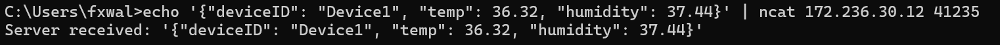
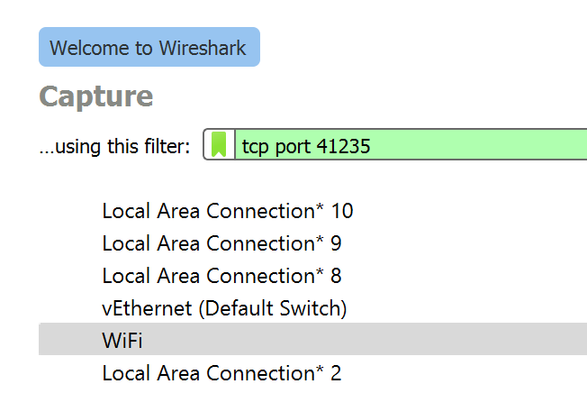
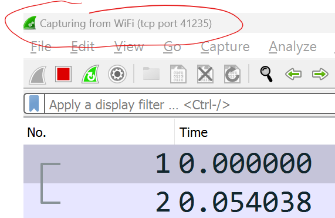
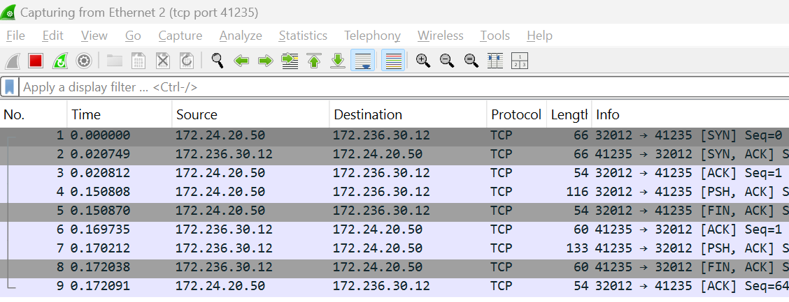
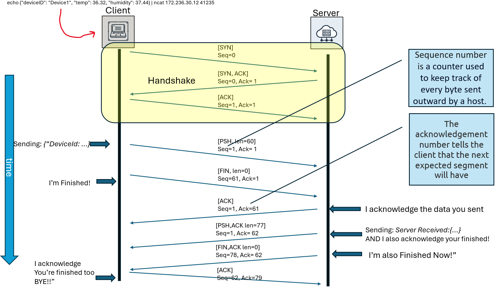

## TCP

You will now complete a similar exercise using TCP.

### TCP Client - Command Line

As before, we can use the Ncat utility to send some TCP segments. 

+ Use Ncat to send a test message to the server as follows:

~~~bash
echo {"deviceID": "Device1", "temp": 36.32, "humidity": 37.44} | ncat 172.236.30.12 41235
~~~

Run the above statement at the command line.  It should work similar to the last step. This time, it will print the server response as shown below:

Here's an explanation of the above statement: 

- `echo '{"deviceID": "Device1", "temp": 36.32, "humidity": 37.44}'`: This outputs/pipes the message to ncat
- `ncat`: BY default, ncat will operate in  **TCP mode**.
- `172.236.30.12 41235: The important bit! The **destination IP address and port number** of the TCP server process you are sending the message.

You should see "Server Received:..." with the message you send echoed back to you. 

Again, we can use Wireshark to have a look at the TCP segment in detail. 

### TCP - Wireshark

Now lets start recording network traffic and examine the TCP interaction:

+ On the Server host, start WireShark recording on the interface connected to the LAN and filter for **tcp port 41235**. The port our server program is using port 41235 and we're only interested in TCP protocol traffic to/from this port number. Apply the filter by entering "tcp port 41235" in the filter field as shown below:  

  

+ Double click on the LAN to start capturing TCP traffic. You should now see an empty packet list pane as follows:
  

## Generate TCP Traffic

+ Return to your terminal window and run the **ncat** UDP command as before. You should have captured traffic similar to the following:
  

Have a look at the data and answer the following question:

+ **Question:** Can you locate the TCP 3-way handshake. How many times does it happen?

The TCP connection is negotiated at each connection, thereafter transmission can commence.

+ Have a closer look at the data that's transmitted. Find the first "push" segment (one with [PSH,ACK] flag, it should contain data) and inspect the encapsulation in the PDU Details Pane:  
  
+ Have a look at the TCP and Data section of the Frame. Notice how the **Flags** in the datagram indicates what type of transmission it is by the location of the '1's. 
+ **Question:** How can the same TCP segment act as an Acknowledgement and a Push?
  *See Slide  on Transport Layer notes : "TCP can piggyback control and data communication by providing control information(such as ACK) along with user data")*
+ **Question:** Can you understand the progression of sequence numbers in the capture? 

### TCP Communication Exchange from Video 
This illustrates the communication that will occur from the NCat command above:

(note sequence numbers may differ slightly from wireshark)

