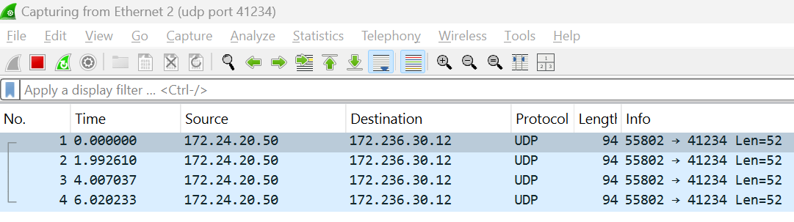
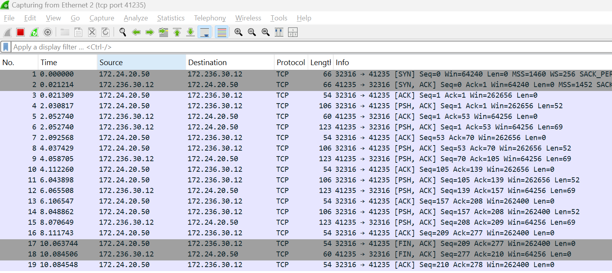

## Optional: Programming using TCP/UDP

Simulating sensors and sensor data using software is common in various fields, especially during the development and testing of IoT devices, robotics, and embedded systems. The purpose of this could be to test particular scenarios and ensure data sent by sensors is received and interpreted correctly. For example, in a data centre, simulated temperature sensors could be used to test that the cooling process is initiated when a threshold is breached. 

From [Web Dev 2 labs](https://tutors.dev/lab/wit-hdip-comp-sci-2024-web-dev-2/topic-03-web-apps/side-unit/book-b-vs-code/01), you already have node.js installed on your machine. You will now use this to run a simple UDP and TCP client program that simulates a sensor, transmitting every 2 seconds.

**NOTE:** These are simple programs for demo purposes only. They contain some characteristics that would be considered poor programming practice, such as "hard coding" of IP values and data.  

### Check for Node

It's worth checking if you have Node installed. Open a terminal and type:~

~~~
node -v
~~~

You should get the current version installed on you machine. if not, install from here:

https://nodejs.org/en

 ### UDP Client 

On your machine, create a new folder called *"compsys-week7"*. Create a file called *"udp-client.js"* with the following content:

~~~javascript
const dgram = require('dgram');
const client = dgram.createSocket('udp4');

const message = JSON.stringify({
  deviceID: 'Device1',
  temp: 36.32,
  humidity: 37.44
});

const serverIP = '172.236.30.12';
const serverPort = 41234;

let count = 0;
const interval = setInterval(() => {
  if (count < 4) {
    client.send(message, serverPort, serverIP, (err) => {
      if (err) {
        console.log('Error sending message: ', err);
      } else {
        console.log(`Message ${count} sent`);
      }
    });
    count++;
  } else {
    clearInterval(interval);
    client.close();
  }
}, 2000);
~~~

+ Now open a terminal window in the same folder as the above program and run using ``node udp-client.js`` , you should see output similar to the following:
  

~~~
> node udp-client.js
Message 1 sent
Message 2 sent
Message 3 sent
Message 4 sent
~~~

This test client is using “hard coded” values in the message. Although you have not covered all of the Javascript concepts shown in this program,  inspect the code and try to evaluate how the program will behave when executed using the following as a guide:

+ The program uses the [dgram](https://nodejs.org/api/dgram.html) module to send UDP datagrams.

+ The server IP and port number is specified as constants.

+ The program sends 4 messages, one every 2 seconds using the `setInterval` function. This is used to repeatedly execute a specified function or code snippet at a set time interval (in milliseconds).

+ Open Wireshark and filter UDP on port 41234 (as you did in UDP Traffic step). You should see the following:
  

### TCP Client 

In the  folder *"compsys-week7"*. Create a file called *"tcp-client.js"* with the following content:

~~~javascript
const net = require('net');

const message = JSON.stringify({
  deviceID: 'Device1',
  temp: 36.32,
  humidity: 37.44
});

const serverIP = '172.236.30.12';
const serverPort = 41235;

let count = 0;

// Create a TCP client socket
const client = new net.Socket();

// Connect to the TCP server
client.connect(serverPort, serverIP, () => {
  console.log('Connected to server');

  // Send the message every 2 seconds, up to 4 times
  const interval = setInterval(() => {
    if (count < 4) {
      client.write(message, (err) => {
        if (err) {
          console.log('Error sending message:', err);
        } else {
          console.log(`Message ${count} sent`);
        }
      });
      count++;
    } else {
      clearInterval(interval);
      client.end(); // Close the connection after sending 4 messages
    }
  }, 2000);
});

// Handle server response (if any)
client.on('data', (data) => {
  console.log('Received from server:', data.toString());
});

// Handle connection close
client.on('close', () => {
  console.log('Connection closed');
});

// Handle error events
client.on('error', (err) => {
  console.log('Connection error:', err);
});
~~~

Now open a terminal window in the same folder as the above program and run using ``node tcp-client.js`` , you should see output similar to the following:

~~~
Pnode tcp-cLient.js 
Connected to server
Message 1 sent
Received from server: Server received: {"deviceID":"Device1","temp":36.32,"humidity":37.44}
Message 2 sent
Received from server: Server received: {"deviceID":"Device1","temp":36.32,"humidity":37.44}
Message 3 sent
Received from server: Server received: {"deviceID":"Device1","temp":36.32,"humidity":37.44}
Message 4 sent
Received from server: Server received: {"deviceID":"Device1","temp":36.32,"humidity":37.44}
Connection closed
~~~

As before, This test client is using “hard coded” values in the message. Inspect the code and try to evaluate how the program will behave when executed using the following as a guide:

+ This time, we use the  [net](https://nodejs.org/api/net.html#net) module to send TCP datagrams.

+ The server IP and port number is specified as constants.
+ The program sends 4 messages, one every 2 seconds using the `setInterval` function. This is used to repeatedly execute a specified function or code snippet at a set time interval (in milliseconds).

Open Wireshark and filter **TCP on port 41235** (as you did in TCP Traffic step). You should see similar output to the following:

Examine how, for each Message transmission cycle, the message from the client to the server and the response from the server is handled by TCP (Frame No. 8,9,10) . 

+ Every message is "ACKed"

Answer the following:
**Question:** Locate the frames responsible for Opening and Closing the TCP connection in your output. Reference course material to make sure you  understand this process. 

**Question:** Again, examine the progression of sequence numbers in the captured segments.

