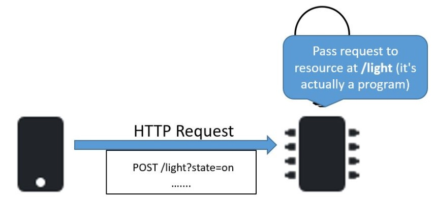

# HTTP and APIs with a Raspberry Pi

For Raspberry Pi - Use HTTP to control a device

## Introduction
In this lab, you will explore the basics of HTTP requests and responses by interacting with an API running on a Raspberry Pi. They will also learn how to control hardware components (like LEDs) and retrieve sensor data over HTTP. You will implement a HTTP Web API that will expose routes that allow clients to connect, get sensor data, and send *commands* ,encoded in the URL query string, to the Raspberry Pi. 
You will also implement a discovery service on the RPi which allows clients to find and acquire it's IP address

## Equipment, Software

+ Raspberry Pi 4
+ SenseHAT
+ Tools for testing HTTP requests (curl, Postman, or a web browser)
+ Raspberry Pi connected to the same network as your computer/Laptop

