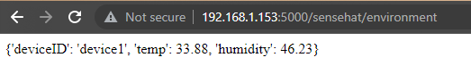

# HTTP API on the RPi

## Setup

### Update the RPi
Run the following to make sure your RPi libraries are up to date:

```bash
sudo apt-get update
```
### Flask and CORs

Lets assume you wish to make the temperature data from the RPi available via a web API. This might be useful for weather station dashboard or other applications, both current and in the future, that need access to the data.

Also, we want to be able to control the LEDs on the SenseHat via a Web API

For this, you will create a simple Web API using Python

Do the following on the Raspberry Pi:

+ Ensure you are in the ~/week9-lab1 folder and the virtual environment is activated:

  ~~~python
  source ./.venv/bin/activate
  ~~~

+ Install Sense Hat library into the virtual environment:
  ~~~
  pip install sense-hat 
  ~~~

  

+ Install Flask 

~~~bash
pip install flask
~~~


Flask is a web framework written in Python that allow you, among other things, to implement web APIs.

+ To allow cross origin requests (CORS), we will also use the ``flask-cors`` library. Although not used in this lab, it would be useful if you use this API in another web application/web site.

```bash
pip install flask-cors
```

You will create an API according to the following design:

| Path to Resource      | GET                                  | POST               |
| --------------------- | ------------------------------------ | ------------------ |
| /sensehat/environment | Get current environment data         | Not Used           |
| /sensehat/light       | Get current light state(i.e. on/off) | Change light state |

+ On your RPi, in ``week9-lab1`` w rite a python program called ``sense_api.py`` that exposes the above specified web API :

~~~python
#!/usr/bin/python3

from flask import Flask, request
from flask_cors import CORS
from sense_hat import SenseHat

sense = SenseHat()
deviceID="device1"
#clear sensehat and intialise light_state
sense.clear()

#create Flask app instance and apply CORS
app = Flask(__name__)
CORS(app)

@app.route('/sensehat/environment',methods=['GET'])
def current_environment():
    temperature=round(sense.temperature,2)
    humidity=round(sense.humidity,2)
    msg = {"deviceID": deviceID,"temp":temperature,"humidity":humidity}
    return str(msg)+"\n"

#Run API on port 5000, set debug to True
app.run(host='0.0.0.0', port=5000, debug=True)
~~~

Examine the above code and try to get an understanding of how it functions: 

1. Find the line ``@app.route('/sensehat/environment',methods=['GET'])``. This line is an *annotation* specifying that a HTTP ``GET`` request with a ``/sensehat/environment`` path will execute the underlying function ``current_environment()``.
2. The ``if __name__ == "__main__":`` checks that the script is being invoked directly from the command line. ``__name__``  is a special variable set by the Python interpreter.
3. The ``app.run(host='0.0.0.0', port=5000, debug=True)`` line runs the Flask process and binds the API to port 5000.

Finally, configure Flask to use your service and run it by **opening a command line in the same folder as *sense_api.py*** and entering the following commands at the command line:

~~~
FLASK_APP=sense_api.py
python sense_api.py
~~~

You should see output similar to the following:
~~~
pi@raspberrypi4:~/week9-lab1 $FLASK_APP=sense_api.py
pi@raspberrypi4:~/week9-lab1 $ python sense_api.py
 * Serving Flask app "sense_api" (lazy loading)
 * Environment: production
   WARNING: This is a development server. Do not use it in a production deployment.
   Use a production WSGI server instead.
 * Debug mode: on
 * Running on http://0.0.0.0:5000/ (Press CTRL+C to quit)
 * Restarting with stat
 * Debugger is active!
 * Debugger PIN: 280-730-140

~~~

This will start the HTTP server on port 5000. 
You should now be able to access the API using HTTP. Leave the SSH session open and server running for the next section. 


## Curl it

Open a command window **On your host machine(laptop).**
You can use [Curl](https://curl.haxx.se/) to check if the API is responding.  
Do the following **On your host machine:**

+ Run ``Curl`` to request the URL resource you want...

```bash
curl -v http://YOUR_PI_IP:5000/sensehat/environment
```

The ``-v`` option indicates we want a verbose response. This way, you can see the raw HTTP message. It will look similar to the following, with some variations depending on your OS/command line tool :
```cmd
PS C:\Users\fxwal> curl -v http://172.24.20.106:5000/sensehat/environment
VERBOSE: GET with 0-byte payload
VERBOSE: received 58-byte response of content type text/html; charset=utf-8

StatusCode        : 200
StatusDescription : OK
Content           : {'deviceID': 'device1', 'temp': 34.18, 'humidity': 51.95}

RawContent        : HTTP/1.0 200 OK
                    Access-Control-Allow-Origin: *
                    Content-Length: 58
                    Content-Type: text/html; charset=utf-8
                    Date: Mon, 11 Nov 2024 09:25:29 GMT
                    Server: Werkzeug/1.0.1 Python/3.9.2

                    {'deviceID': 'd...
Forms             : {}
Headers           : {[Access-Control-Allow-Origin, *], [Content-Length, 58], [Content-Type, text/html; charset=utf-8],
                    [Date, Mon, 11 Nov 2024 09:25:29 GMT]...}
Images            : {}
InputFields       : {}
Links             : {}
ParsedHtml        : mshtml.HTMLDocumentClass
RawContentLength  : 58
```

Note the following:
``StatusCode`` of 200 indicates successful response from the server

``RawContent`` shows the raw HTTP response with the payload curtailed. 

### Use a Browser

+ Enter the above URL into the address field of a browser on your host machine/laptop and you should see something similar to the following:




## Actuating the Light

You now need to implement the code that will:
1.  Accept a HTTP POST request on route /sensehat/light/.
2.  Parse the parameter string for command data, and turn the LEDS on/off accordingly.
3.  Accept a HTTP GET request on route /sensehat/light/ and return the current state of the light. 

+ Go back to your SSH session and stop the server by entering *ctrl + c*.
+ Add the following code to the *sense_api.py* script just under the existing ``current_environment()`` function. Watch the indentation!

```python
@app.route('/sensehat/light',methods=['GET'])
def light_get():
    #check top left pixel value(==0 - off, >0 - on) 
    print(sense.get_pixel(0, 0)) 
    if sense.get_pixel(0, 0)[0] == 0:
        return '{"state":"off"}'
    else:
        return '{"state":"on"}'

@app.route('/sensehat/light',methods=['POST'])
def light_post():
    state=request.args.get('state')
    print (state)
    if (state=="on"):
        sense.clear(255,255,255)
        return '{"state":"on"}'
    else: 
        sense.clear(0,0,0)
        return '{"state":"off"}'
```


+ If you stopped the server, restart it and leave the SSH session open and the server running 
+ Open a command window on you **host machine/laptop** and do the following.
+ Turn on the LED array (light) using a  ``HTTP POST`` request to ``/sensehat/light`` with the query string ``state=on`` as follows:

```bash
curl -Method POST http://YOUR_PI_IP:5000/sensehat/light?state=on
```

+ Turn it off using a query string ``state=off``

```bash
curl -Method POST http://YOUR_PI_IP:5000/sensehat/light?state=off
```

You can now control the "Smart light" via a Web API. 

