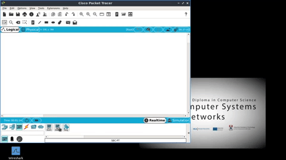

## HTTP API: Sensing and Acutating

Now that the api is tested and working, let's hook it up to a sensor. As we are using our RPi already, we can simulate a sensor in Packer Tracer. The situation we will model is as follows:

Your RPi is a Prototypical Smart Security Light that can also measure environment data (e.g. temperature). You want to connect it to a Motion Sensor that, when activated, will rend a request to the light to turn it on. In the absence of hardware, we can simulate the motion sensor in Packet Tracer using IoT components

In Packet Tracer you to program the Single Board Computer (SBC) using Pyhton. It also has the ability to connect to the Real network so we can integrate simulated virtual components with real physical ones, like the RPi and SenseHAT. 

# Prerequesites: 

+ Start your Python HTTP API on the Raspberry Pi and leave it running.

+ Open Packet Tracer and add an SBC and a Motion Detector as shown below: 



+ Connect **D0** on the Single Board Computer (SBC) to **D0** on the Motion Sensor using a Custom IoT Cable.
+ Double Click on the SBC and select the Programming Tab
+ Click on *New* to create a New programming project. Enter *HTTP CLient* as the project name and *Real HTTP Client - Python* as the template


+ In the programming window, the left side is the files, right side is the editor. Select *main.py* in the files  and have a look at the code. It uses the ``url`` variable to make a http GET request. In this example, it makes a HTTP request for the Cisco Website. Can you identify the function that handles the response? 

+ Click on the *Run* button and check out the response. You'll get a status code and data, if any. What's the value of the status code and what doe is mean?

## Sensor Code

You will now add code that will take in reading from the Motion sensor (HIGH or LOW ), and send the appropriate request the Security Light (i.e. your RPi).      

+ Replace the code with the following ,and modify the URLs to refer to your Raspberry Pi.

```python
from realhttp import *
from time import *
from gpio import *

resourceURL = "http://172.24.10.250:5000/api/leds"
pinMode(0,IN)

http = RealHTTPClient()

#Event Handler for digital port 0
def handleButtonEvent():
	headers = {"Content-Type": "application/json"}
	print("Button Clicked")
	buttonState = digitalRead(0)
	if buttonState==LOW:
		http.put(resourceURL,'{"state":"off"}',headers)
	else:
		http.put(resourceURL,'{"state":"on"}',headers)

#prints the HTTP response to the console
def onHTTPDone(status, data):
    print("status: " + str(status))
    print("data: " + data)

def main():
    add_event_detect(0, handleButtonEvent) # add event handler to port 2
    http.onDone(onHTTPDone)

    # don't let it finish
    while True:
        sleep(1)

if __name__ == "__main__":
    main()

```

+ Click the *Run* button and you should start seeing output straight away in the ssh session (HTTP Request data) and in the Packettracer console (HTTP response data)
+  To simulate motion, hold the *alt* key down and put the cursor over the Motion Sensor in the topololgy. You should see the HTTP request state value change to on and the LEDs on the RPI should light up.

So this simulates how you could use a HTTP enabled motion sensor to actuate something, in this case a light. 

## Dynamic IPs
Your Raspberry Pi dynamically acquires it's IP address from the DHCP server on your router (probably). 

**Question:** What risk does this pose to long term communication between the sensor SBC and the RPi? 

**Question:** How could it be alleviated? (this will be discussed in the next step...)