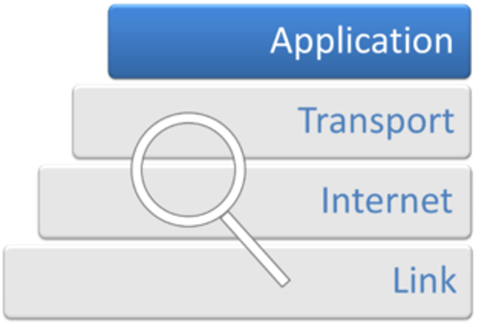
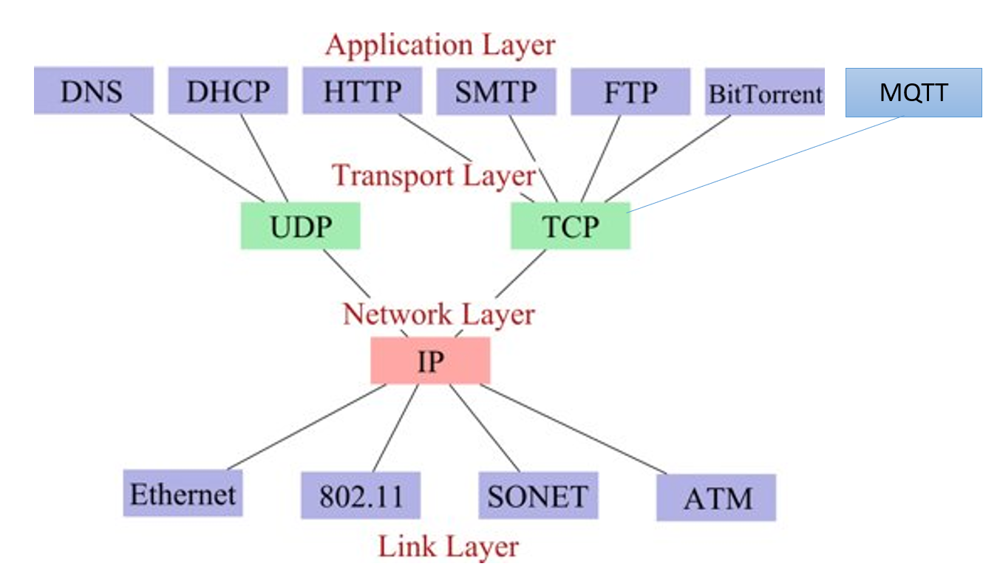
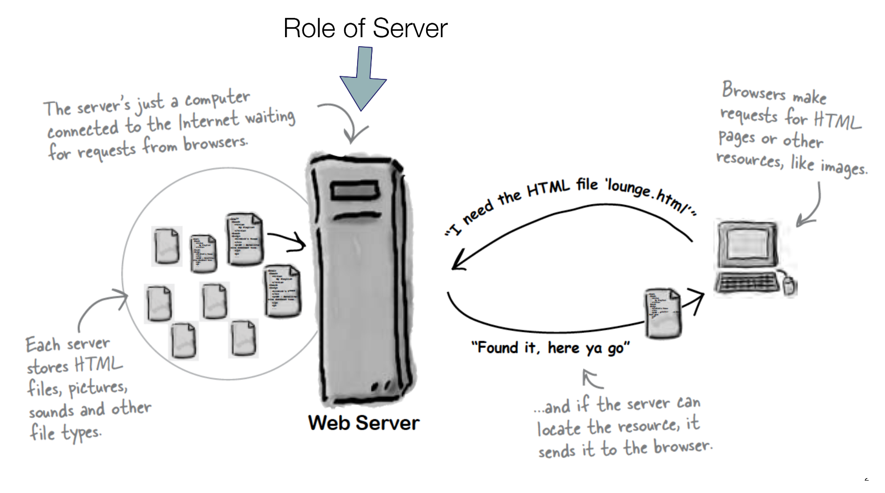
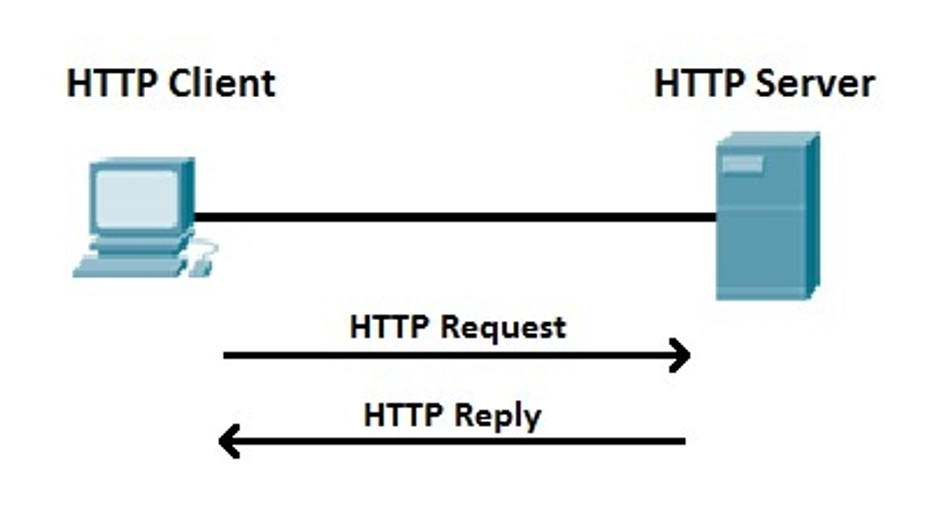

# HTTP

WEB APIs 

## *APIs and Messaging*

Frank Walsh
2024

---
# Recap: Application Layer

+ The application layer provides the interfaces and protocols needed by users/applications to access the network
+ It facilitates the users/network-based applications to use the services of the network.



---
# Recap: TCP/IP Protocol Stack


---
# Web APIs
+ Programmatic interface exposed via the Web
+ Typical use of a Web API:
    + Expose application functionality via the web
    + Expose data via the Web(OpenWeatherMap)
+ Typically implements **HTTP**
    + Hypertext Transfer Protocol
+ Usually runs on machine connected to a network
    + Has an **IP address**
---
# What's HTTP 
+ Remember this from Web Dev 1
 
---
# What's HTTP 
+ Remember this from Web Dev 1

---
# What's HTTP
+ HyperText Transfer Protocol
+ Protocol used in World Wide Web
    + http://www.setu.ie
+ Your browser communicates using HTTP (HTTP Client)
+ **Devices can also communicate using HTTP**
+ Simple, ubiquitous. 

---
# HTTP: Key Parts
---
# Flask Hello World
```python
from flask import Flask

app = Flask(__name__)

@app.route('/')
def hello():
    return "Hello, World!"
```
- Explanation:
  - `app = Flask(__name__)`: Initializes a new Flask application.
  - `@app.route('/')`: Defines a route for the home page (`/`) and binds it to the `hello` function.

---

# **Running the Flask App**
- **Starting the Flask Server**:
  - Run the app with the following command:
    ```bash
    flask run
    ```
- **Accessing the App**:
  - Go to `http://IP_OF_HOST_RUNNING_APP:5000` in your browser to see "Hello, World!" displayed.

---
