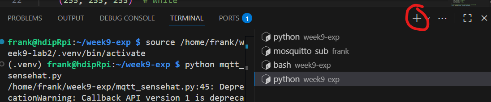

## Publish Environment Data

In this step we want to publish telemetry periodically to:

**Topic:** `/<userID>/telemetry/environment`

**Payload:** `{"userID":"device1","temp":22.7,"humidity":48.2,"ts":<unix>}`

**QoS:** 0, **Retained:** yes

As before, SSH into your RPi. Create a new folder `week9-lab2` and Activate a new Python Virtual Environment in it:

```
mkdir ~/week9-lab2
cd ~/week9-lab2
python -m venv --system-site-packages .venv
source ./.venv/bin/activate
```

Create a file called `sense_mqtt.py` 

Paste the following code:

```python
#!/usr/bin/env python3
import os, time, json
import paho.mqtt.client as mqtt
from sense_hat import SenseHat

# Config (env variables with defaults) 
USER_ID = os.getenv("USER_ID", "fxwalsh")
BROKER    = os.getenv("MQTT_BROKER", "test.mosquitto.org")
TELEMETRY_PERIOD_S = float(os.getenv("TELEMETRY_PERIOD_S", "10"))

#Topics
TELEMETRY_TOPIC = f"/{USER_ID}/telemetry/environment"

#Hardware
sense = SenseHat()
sense.clear(0, 0, 0)

#MQTT client
client = mqtt.Client(client_id=f"{USER_ID}-edge")

def read_environment():
    return {
        "temp": round(sense.temperature, 2),
        "humidity": round(sense.humidity, 2),
    }

def main():
    client.connect(BROKER)

    next_pub = time.monotonic()  # heartbeat timer

    while True:
        # Process MQTT network I/O without using a background thread
        client.loop(timeout=0.5)

        now = time.monotonic()
        if now >= next_pub:
            env = read_environment()
            payload = {
                "userID": USER_ID,
                "temp": env["temp"],
                "humidity": env["humidity"],
                "ts": int(time.time())
            }
            # QoS 0 for frequent telemetry; retain latest for late subscribers
            client.publish(TELEMETRY_TOPIC, json.dumps(payload), qos=0, retain=True)
            print("Telemetry:", payload)
            next_pub = now + TELEMETRY_PERIOD_S

        time.sleep(0.1)

if __name__ == "__main__":
    main()
```

------

## Test Your MQTT Integration

You will now use the command-line tools installed previously to test the program. Open **two terminals** on your Raspberry Pi. You can do this by either:

a. Open a second terminal window on your laptop and create another SSH session with the RPi

b. Using VS Code: Click on the + icon on the Terminal View:


### Terminal 1 – Run the app:

```
python sense_mqtt.py
```

### Terminal 2 – Subscribe to messages:

Replace `<UserID>` with your unique user ID used in the above program.

```
mosquitto_sub -h test.mosquitto.org -t /<UserID>/telemetry/environment
```

You should see a message every ~`TELEMETRY_PERIOD_S` seconds.

### Code Logic Overview:

- The variable (`next_pub`) is used to to  **publish telemetry every N seconds** (heartbeat).
- MQTT I/O is handled via `client.loop(timeout=...)` inside your main loop.
- Telemetry uses **QoS 0** and is **retained** so new subscribers instantly see the latest reading.

```

```

