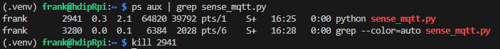

# Advertise online/offline (LWT)

In this step, you will publish the status of the device, essentially telling subscribers if the device is available. 

- You set a **Last Will & Testament** so the broker publishes `"offline"` if the device disappears unexpectedly.
- On successful connect, you publish `"online"` (retained).
- On graceful shutdown, you also publish `"offline"` so presence stays accurate.

Add the following imports to the top of the script. 

```python
import sys, signal
```

Add the Status topic to the topics section at the top of the program

```python
STATE_LEDS_TOPIC= f"/{USER_ID}/state/leds"
STATUS_TOPIC   = f"/{USER_ID}/status"
```

Add the following code before the `main()` function to set the Last Will and Testament message

```python
# Before connecting:
client.will_set(STATUS_TOPIC, payload="offline", qos=1, retain=True)
```

Update the `on_connect` function as follows

```
def on_connect(c, u, f, rc):
    print("MQTT connected:", rc)
    c.publish(STATUS_TOPIC, "online", qos=1, retain=True)
    c.subscribe(CMD_LEDS_TOPIC)


```

Add the following above the ``main()`` function

```python
def shutdown(*_):
    try:
        client.publish(STATUS_TOPIC, "offline", qos=1, retain=True)
        client.disconnect()
    except Exception:
        pass
    sys.exit(0)

signal.signal(signal.SIGINT, shutdown)
signal.signal(signal.SIGTERM, shutdown)
```

**Test**

```python
mosquitto_sub -h test.mosquitto.org -t '/<USER_ID>/status' -v
# Start MQTT program → "online"

```

Test program stopping by Ctrl+C in terminal running mqtt program. This will result in  "offline" message
You can simulate a crash/going off line by opening another terminal and killing the mqtt process using `ps` and `kill`. Broker eventually publishes "offline" via LWT

**Terminal: Subscribing to `/<USER_ID>/status` topic**


**Terminal: Find and Kill MQTT process using `ps`**



------

- 