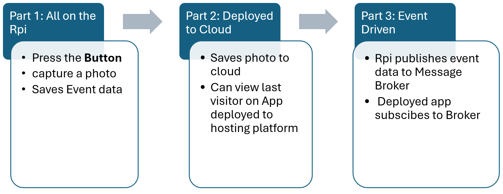

# Introduction 

In this lab you will build a smart doorbell app. 

There are 3 parts to this lab:

By the end of part 1,  you’ll have a URL like `http://hdiprpi:8000/` showing the last person who pressed the button.

By the end of part 2, you’ll have a URL like `https://smart-doorbell.onrender.com/` showing the last person who pressed the

By the end of part 3, you will have a decoupled Event Driven application. 

---

## Prerequisites

Hardware:

- **Raspberry Pi 4** (any RAM size)
- **Raspberry Pi Camera Module 3** connected to the CSI port
- xxxxxxxxxx git add .git commit -m "Describe your change"git pushbash
- Network connectivity (Ethernet or Wi-Fi)

Software:

- **Raspberry Pi OS (Trixie)** (Debian 13–based) installed and booting
- Camera interface enabled 
- Render and Cloudinary accounts

