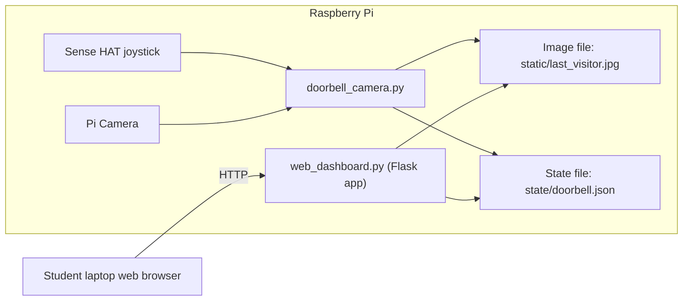

### System Overview – Part 1 (Everything on the Raspberry Pi)

The first part of the lab runs **entirely on the Raspberry Pi**:

- `doorbell_camera.py`:
  - Listens for the **Sense HAT joystick** press (doorbell).
  - Uses the **Pi Camera** to capture a photo.
  - Saves the image as `static/last_visitor.jpg`.
  - Stores metadata (timestamps, etc.) in `state/doorbell.json`.

- `web_dashboard.py` (Flask web server):
  - Reads `static/last_visitor.jpg` and `state/doorbell.json`.
  - Serves a simple web page showing the **most recent visitor image**.
  - Can be viewed from a browser on the same network.

#### Architecture Diagram – Part 1




## Install required packages

Update and install the Python libraries from apt. You probably have most of them already from the previous labs but does no harm to make sure:

```bash
sudo apt update
sudo apt install -y  python3-paho-mqtt python3-picamera2 sense-hat
```

Create a `requirements.txt` in `smart-doorbell/` :

```bash
cat > requirements.txt << 'EOF'
flask
paho-mqtt
picamera2
sense-hat
EOF
```

---

### Create and activate the virtual environment

Ad before, create a virtual environment inside your project folder:

```bash
cd ~/week10-lab1
python -m venv .venv --system-site-packages
```

- `.venv` is the folder where the environment lives.
- `--system-site-packages` lets the venv reuse system packages (like `picamera2` & `sense_hat`) installed via `apt`.

Activate the venv:

```bash
source .venv/bin/activate
```

Your shell prompt should now show something like:

```text
(.venv) frank@hdiprpi:~/week10-lab1 $
```

> Any time you open a **new terminal** for this project, run:
>
> ```bash
> cd ~/week10-lab1
> source .venv/bin/activate
> ```

## Test the camera from Python

First, confirm you can capture a still image programmatically on Trixie with Picamera2.

In the project folder, create `test_camera.py` and paste the following into it

```python
#!/usr/bin/env python3
from picamera2 import Picamera2
from time import sleep

picam2 = Picamera2()
picam2.configure(picam2.create_still_configuration())
picam2.start()

print("Warming up camera...")
sleep(2)

output_file = "test.jpg"
print(f"Capturing image to {output_file}...")
picam2.capture_file(output_file)

picam2.stop()
print("Done.")
```

Run it:

```bash
python test_camera.py
ls -l test.jpg
```

If `test.jpg` exists and has a non-zero size, your **Pi 4 + Camera v3 + Trixie** combo is working correctly. If you are using VS Code you can view the image by selecting it in the explorer
