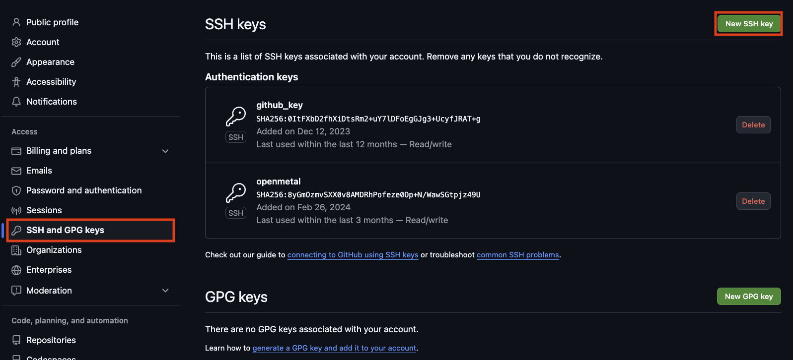
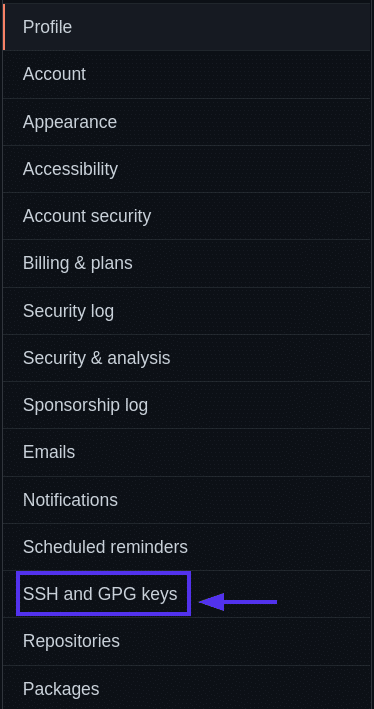

## Git It

Let’s start by creating a local repo for your Smart Door project and push it to a GitHub repo.

### Create a new repository on GitHub

1. Log in to GitHub in your browser.
2. Click **"New"** to create a new repository.
3. Name it something like **`smart-doorbell`**.
4. Make it **private**.
5. **Do not** **Add** a README, `.gitignore`, or license yet (we'll create a README on the RPi).
6. Click **Create repository** and leave the instructions page open.

### Create the Lab folder

On the RPi:

```bash
cd ~
mkdir -p week10-lab1/static week10-lab1/state week10-lab1/templates
cd week10-lab1
```

Create a minimal `README.md` to describe the project (this is going to be a git repo soon....):

```bash
cat > README.md << 'EOF'
# Smart Doorbell

Press the Sense HAT joystick to capture a photo with the Pi camera.
A Flask web page shows the last visitor and the time of the press.
EOF
```

---


### Install and initialise git on the Pi

On the Pi:

```bash
cd ~/week10-lab1
sudo apt install -y git
git init
```

Configure your identity for git. Make sure it matched what you're using on Github

```bash
git config --global user.name "Your Name"
git config --global user.email "your.email@example.com"
```

### **Generate a New SSH Key Pair** for Github

Create a secure Ed25519 SSH key:

```
ssh-keygen -t ed25519 -C "your_email@example.com"
```

When prompted:

- **File location**: press **Enter** to accept default
- **Passphrase**: leave empty

This creates:

- `~/.ssh/id_ed25519` (private key)
- `~/.ssh/id_ed25519.pub` (public key)

Display the public key:

```
cat ~/.ssh/id_ed25519.pub
```

Copy the **entire line** starting with:

```
ssh-ed25519
```

You will paste this into GitHub.

### **Add the Public Key to GitHub**

1. Log in to GitHub.
2. Go to **Settings → SSH and GPG keys**.
3. Click **New SSH key**.
4. Title: something like **Raspberry Pi**.
5. Paste the public key.
6. Click **Add SSH key**.





------

## **Test the SSH Connection to GitHub**

Back on the Raspberry Pi, run:

```
ssh -T git@github.com
```

You should see something like:

```
Hi username! You've successfully authenticated...
```

If you see a warning about authenticity, type **yes** and press Enter.

You should now be able to push **without entering a username or password**.

### Make the first commit

```bash
cd ~/week10-lab1
git add .
git commit -m "Initial smart doorbell lab"
```

### Add the GitHub remote and push

Replace `<your-username>` with your GitHub username:

```bash
git branch -M main
git remote add origin git@github.com:<your-username>/<your-git-repo>.git
git push -u origin main
```

If you used SSH instead of HTTPS, use the `git@github.com:...` URL instead. You will need to authenticate with Github. 

After this:

- Your **Local** and **GitHub repository** are in sync.

- Future changes on the Pi can be committed and pushed with:

  ```bash
  git add .
  git commit -m "Describe your change"
  git push
  ```
