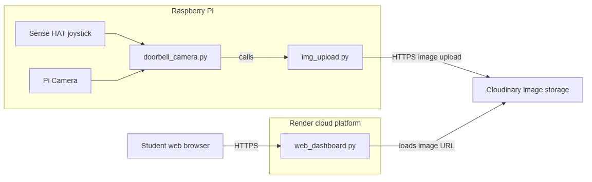

### System Overview – Part 2 (Web Dashboard deployed to Render)

In the previous release, its all going on in the RPi, and you cannot access the web dashboard if you are external to your home LAN. The iimage and status is stored on the RPi. We would like to see the dashboard acfcessable on the internet 

In this step you’ll perform 2 steos to make this possible. 

+ upload an image from your Raspberry Pi (or laptop) to **Cloudinary** and get back a public URL.
+ deploy your web dashboard to Render. 

##### Architecture Diagram – Part 2




---

#### Create a free Cloudinary account

1. Go to the Cloudinary website and sign up for a **free** account.
2. After logging in, open the **Dashboard**.
3. Note the three values under *Account Details*:
   - **Cloud name**
   - **API Key**
   - **API Secret**

You will paste these into your Python code.

---

#### Install the Cloudinary Python library

On the Raspberry pi  where you are running the dorrbell_camera,py script,  install the Cloudinary SDK:

```
pip install cloudinary
```


#### Create an upload script
Create a new file called `upload_photo.py` in your working directory:

```python
import cloudinary
import cloudinary.uploader
import os

# Configure Cloudinary connection (fill these in from your dashboard)
cloudinary.config(
    cloud_name="YOUR_CLOUD_NAME",   # e.g. "mydemo123"
    api_key="YOUR_API_KEY",         # e.g. "123456789012345"
    api_secret="YOUR_API_SECRET",   # long secret string

# Choose the local image file to upload
BASE_DIR = os.path.dirname(os.path.abspath(__file__))
STATIC_DIR = os.path.join(BASE_DIR, "static")
IMAGE_PATH = os.path.join(STATIC_DIR, "last_visitor.jpg")

# Upload the image
def upload_image(image_path,
                 folder = "smart-doorbell-lab",
                 public_id = "last_visitor"):
    result = cloudinary.uploader.upload(
        image_path,
        folder="smart-doorbell-lab",  # optional logical folder name
        public_id="last_visitor",      # <-- always upload with same ID
        overwrite=True,                # <-- overwrite existing image
        invalidate=True,               # <-- (optional) clear cached copies
    )
    url = result["secure_url"]
    return url

def main():
    url = upload_image(IMAGE_PATH)
    print("Upload complete.")
    print(f"Public URL:{url}")

if __name__ == "__main__":
    main()


```
Important: Replace `YOUR_CLOUD_NAME, YOUR_API_KEY,` and
`YOUR_API_SECRET` with the values from your own Cloudinary dashboard.

#### Test the upload
Run the script:

```bash
python upload_photo.py
```
If everything is configured correctly, you should see output similar to:

```bash
Upload complete.
Public URL: https://res.cloudinary.com/your-cloud-name/image/upload/v1234567890/smart-doorbell-lab/xyz.jpg
```
Copy the Public URL into a browser – you should see your image.

