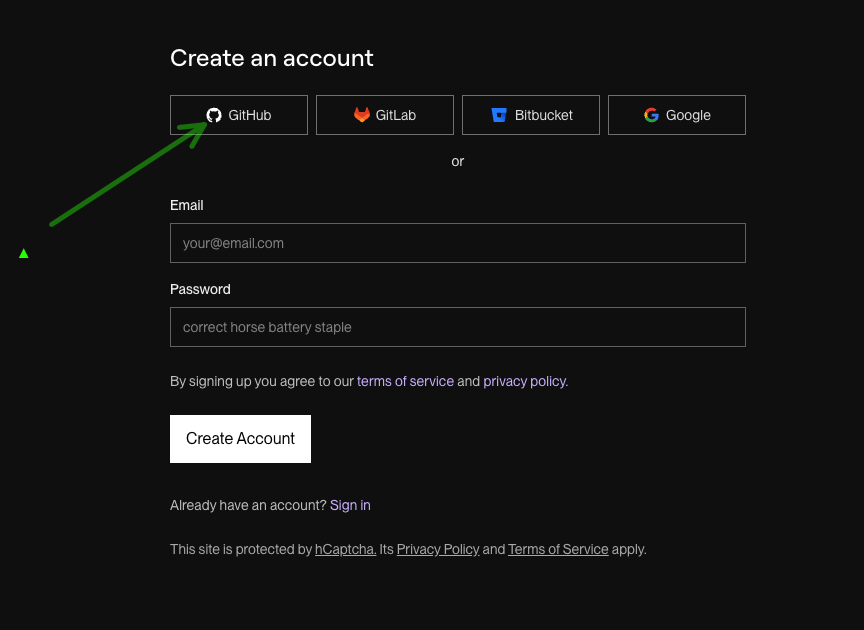
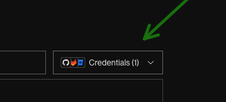
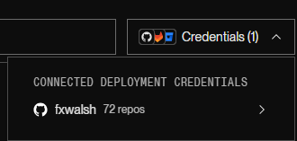
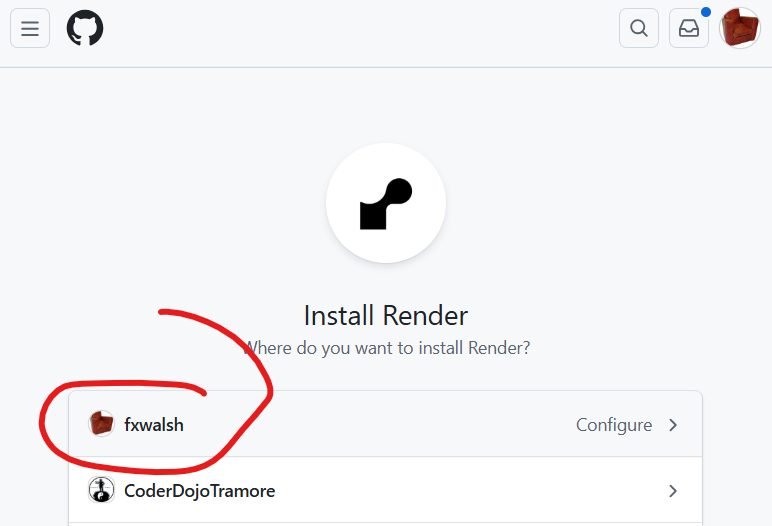
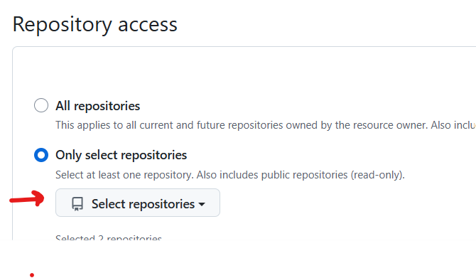
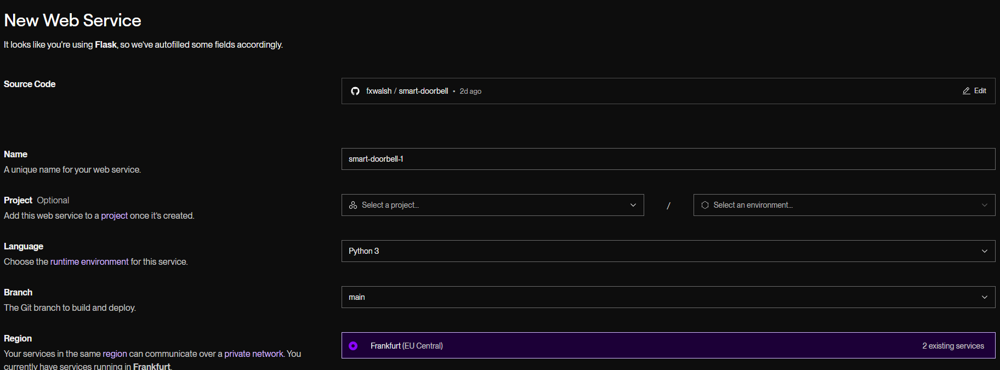
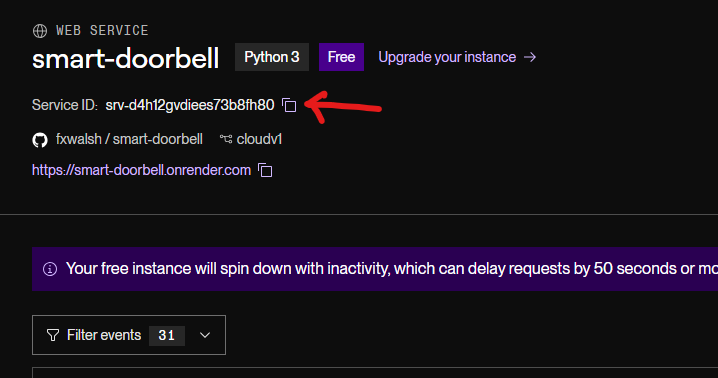

### Part 2:  Deployed to Render & Cloudinary

In the previous release, its all going on in the RPi, and you cannot access the web dashboard if you are external to your home LAN. The iimage and status is stored on the RPi. We would like to see the dashboard acfcessable on the internet 

In this step you’ll perform 2 steos to make this possible. 

+ upload an image from your Raspberry Pi (or laptop) to **Cloudinary** and get back a public URL.
+ deploy your web dashboard to Render. 

##### Architecture Diagram – Part 2


---

#### Create a free Cloudinary account

1. Go to the Cloudinary website and sign up for a **free** account.
2. After logging in, open the **Dashboard**.
3. Note the three values under *Account Details*:
   - **Cloud name**
   - **API Key**
   - **API Secret**

You will paste these into your Python code.

---

#### Install the Cloudinary Python library

On the Raspberry pi  where you are running the dorrbell_camera,py script,  install the Cloudinary SDK:

```
pip install cloudinary
```


#### Create an upload script
Create a new file called `upload_cloudinary.py` in your working directory:

```python
import cloudinary
import cloudinary.uploader
import os

# Configure Cloudinary connection (fill these in from your dashboard)
cloudinary.config(
    cloud_name="YOUR_CLOUD_NAME",   # e.g. "mydemo123"
    api_key="YOUR_API_KEY",         # e.g. "123456789012345"
    api_secret="YOUR_API_SECRET",   # long secret string
)
# Choose the local image file to upload
BASE_DIR = os.path.dirname(os.path.abspath(__file__))
STATIC_DIR = os.path.join(BASE_DIR, "static")
IMAGE_PATH = os.path.join(STATIC_DIR, "last_visitor.jpg")

# Upload the image
def upload_image(image_path,
                 folder = "smart-doorbell-lab",
                 public_id = "last_visitor"):
    result = cloudinary.uploader.upload(
        image_path,
        folder="smart-doorbell-lab",  # optional logical folder name
        public_id="last_visitor",      # <-- always upload with same ID
        overwrite=True,                # <-- overwrite existing image
        invalidate=True,               # <-- (optional) clear cached copies
    )
    url = result["secure_url"]
    return url

def main():
    url = upload_image(IMAGE_PATH)
    print("Upload complete.")
    print(f"Public URL:{url}")

if __name__ == "__main__":
    main()


```
Important: Replace `YOUR_CLOUD_NAME, YOUR_API_KEY,` and
`YOUR_API_SECRET` with the values from your own Cloudinary dashboard.

#### Test the upload
Run the script:

```bash
python upload_cloudinary.py
```
If everything is configured correctly, you should see output similar to:

```bash
Upload complete.
Public URL: https://res.cloudinary.com/your-cloud-name/image/upload/v1234567890/smart-doorbell-lab/xyz.jpg
```
Copy the Public URL into a browser – you should see your image.

### Update doorbell_camera.py

Add the following import to the top of the doorbell_camera.py.

```python
from upload_cloudinary import upload_image
```

Now use it to put the image onto Cloudinary. Update the button pressed condition to call the upload_image(IMAGE_PATH) function and put the returned url into the state:

~~~python
.....
.....
try:
    while True:
        for event in sense.stick.get_events():
            if event.action == "pressed" and event.direction == "middle":
                print("Doorbell pressed at", datetime.now())
                capture_photo()
                url = upload_image(IMAGE_PATH) ####ADD THIS LINE##### 
                save_state(url)    ####UPDATE THIS LINE##### 
        time.sleep(0.1)
except KeyboardInterrupt:
    print("Exiting...")
finally:
    picam2.stop()
    sense.clear()
~~~

Now Replace the contents of  **`/templates/template.html`** with the following code:

~~~html
<!doctype html>
<html>
<head>
  <meta charset="utf-8">
  <title>Smart Doorbell</title>
  <meta http-equiv="refresh" content="10"> 
  <style>
    body { font-family: sans-serif; max-width: 640px; margin: 2rem auto; text-align: center; }
    img  { max-width: 100%; height: auto; border-radius: 12px; box-shadow: 0 0 12px rgba(0,0,0,0.25); }
    .meta { margin-top: 1rem; color: #444; }
  </style>
</head>
<body>
  <h1>Smart Doorbell</h1>

  
    <p class="meta">
      Last press: <strong>{{ last_event.time_str }}</strong><br>
      ({{ last_event.age }} seconds ago)
    </p>
    
  
    <p>No doorbell presses recorded yet.</p>
  
</body>
</html>
~~~


# Deploy web_dashboard.py to Render

You should have an account on Render already from Web Dev 2. If you do not have an account, go to https://render.com/ and create an account using “Getting Started”. You can use your GitHub account to sign up, which is recommended.



Once your account is created, you will want to create a new Web Service. Depending on how the website redirects you, you may launch into a wizard immediately, or you may need to click on “Add New” and then “Web Service”.

Select the Git Provider and click on the Credentials dropdown to select GitHub. If you have not connected your GitHub account yet, you will be prompted to do so.



Click your github username in the dropdown, and then select the repository you created earlier (e.g. `smart-doorbell`).



If it is a private repository (preferred) it may not be visible so click on the Configure in GitHub option.


This will bring you to github where you can select your account



Scroll down and select the specific repository to allow it access:



Then find you repo in the list:


Now select the repository in render.



Step down through the options and

- Name your service (e.g. `smart-doorbell`).
- Select the Language as `python 3`.
- Select the branch you want to deploy (e.g. `main`).
- Select the region you want to deploy thats closest to you (e.g. `Frankfurt (EU Central)`).
- Root directory should be left blank.
- The Build Command should be `pip install -r requirements.txt` 
- The start command should be `gunicorn web_dashboard:app`.
- Select the hobby project plan.
- Click “Deploy Web Service”

Now use the URL from Render to view the Web Dashboard:

