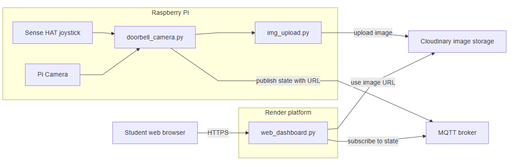

## 	Part 3: MQTT doorbell events

If you want to broadcast doorbell presses to the cloud as well, extend `doorbell_camera.py` to publish an MQTT message every time the doorbell is pressed.

#### Architecture Diagram - Part 3




### Add MQTT to the doorbell_camera.py  script

Near the top of `doorbell_camera.py`:

```python
import paho.mqtt.client as mqtt

MQTT_BROKER = "broker.hivemq.com"
MQTT_PORT = 1883
MQTT_TOPIC = "/<YOUR-ID>/event/doorbell"  # change to your own ID 

client = mqtt.Client()
client.connect(MQTT_BROKER, MQTT_PORT, 60)
client.loop_start()
```

add the following after `save_state(url)`:

```python
          with open(STATE_PATH, 'r') as f:
                payload = json.load(f)
          client.publish(MQTT_TOPIC, json.dumps(payload))
          print("MQTT event published:", payload)
```

Be careful to keep indentation correct here.
And in the `finally:` block, add:

```python
client.loop_stop()
client.disconnect()
```

Now each press:

- Captures an image  
- Updates the JSON state  
- Publishes an MQTT message that other services/dashboards can subscribe to  

#### Add MQTT to web_dashboard.py script

Now we wouls like the dashboard.py script to subscribe to the doorbell event and update the state.

Replace the web_dashboard.py script with the following:

~~~python
#!/usr/bin/env python3
import os, json, time, datetime
from flask import Flask, render_template
import paho.mqtt.client as mqtt

BASE_DIR = os.path.dirname(os.path.abspath(__file__))
STATE_DIR = os.path.join(BASE_DIR, "state")
STATE_PATH = os.path.join(STATE_DIR, "doorbell.json")

app = Flask(__name__, static_folder="static")

# MQTT CONFIG
MQTT_BROKER = "broker.hivemq.com"
MQTT_PORT = 1883
MQTT_TOPIC = f"/<YOUR-ID>/event/doorbell"  # UPDATE THIS TO YOUR ID

def load_state():
    try:
        with open(STATE_PATH) as f:
            data = json.load(f)
        ts = data.get("ts")
        if not ts:
            return None
        age = int(time.time()) - ts
        time_str = datetime.datetime.fromtimestamp(ts).strftime("%Y-%m-%d %H:%M:%S")
        data["age"] = age
        data["time_str"] = time_str
        return data
    except FileNotFoundError:
        return None
    except Exception as e:
        print("Error loading state:", e)
        return None

@app.route("/")
def index():
    last_event = load_state()
    return render_template(
        'status.html',
        last_event=last_event
    )

# --- MQTT CALLBACKS ---

def on_connect(client, userdata, flags, rc):
    print("MQTT connected with result code", rc)
    client.subscribe(MQTT_TOPIC)
    print("Subscribed to:", MQTT_TOPIC)


def on_message(client, userdata, msg):
    print("MQTT message on", msg.topic)
    try:
        payload_str = msg.payload.decode("utf-8")
        data = json.loads(payload_str)
    except Exception as e:
        print("Error parsing payload as JSON, storing raw text:", e)
        payload_str = msg.payload.decode("utf-8", errors="replace")
        data = {"raw": payload_str}

    # Ensure there's a timestamp
    if "ts" not in data:
        data["ts"] = int(time.time())

    try:
        with open(STATE_PATH, "w") as f:
            json.dump(data, f)
        print("State updated:", data)
    except Exception as e:
        print("Error writing state file:", e)
# Set up MQTT client
mqtt_client = mqtt.Client()
mqtt_client.on_connect = on_connect
mqtt_client.on_message = on_message

mqtt_client.connect(MQTT_BROKER, MQTT_PORT, 60)
mqtt_client.loop_start()  # run MQTT network loop in background thread

if __name__ == "__main__":
    app.run(host="0.0.0.0", port=8000)
~~~

#### Commit it

Commit your changes:

~~~bash
git add .
git commit -m "Updated to use MQTT"
git push 
~~~


On Render, your commit should be picked up and the app will be redeployed.  


## Test the whole lot

1. On the Pi 4: run the camera app(if not already running)

   ```bash
   cd ~/smart-doorbell
   
   python doorbell_camera.py
   ```

   

3. In a browser, go to your render App

4. Now press the Sense HAT joystick (middle) on the Pi 4.

   - The first terminal should show “Doorbell pressed!”.
   - The image and timestamp should update on the web page (it auto-refreshes every 10 seconds).

