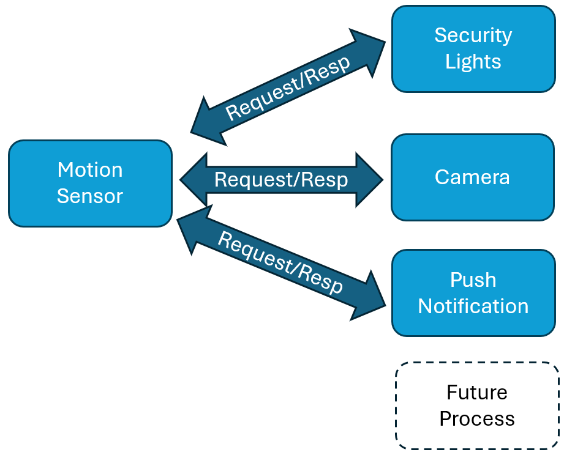
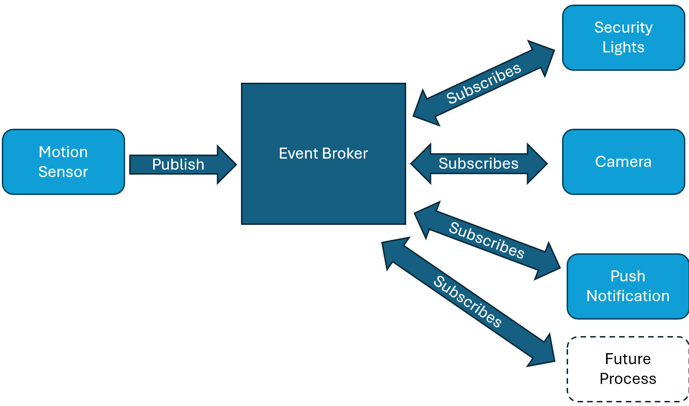
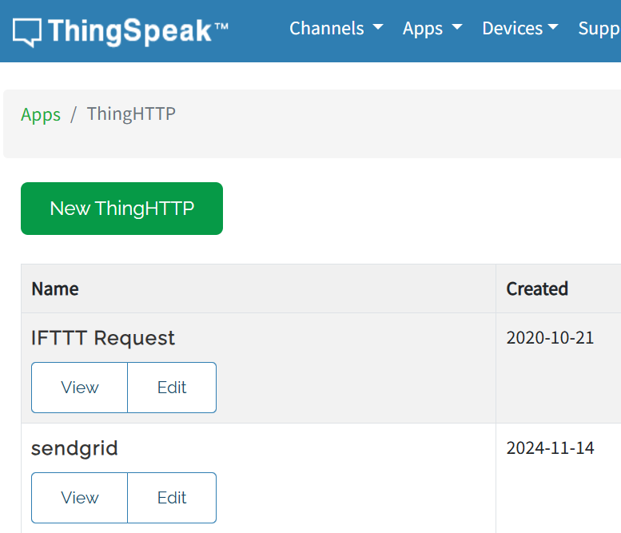
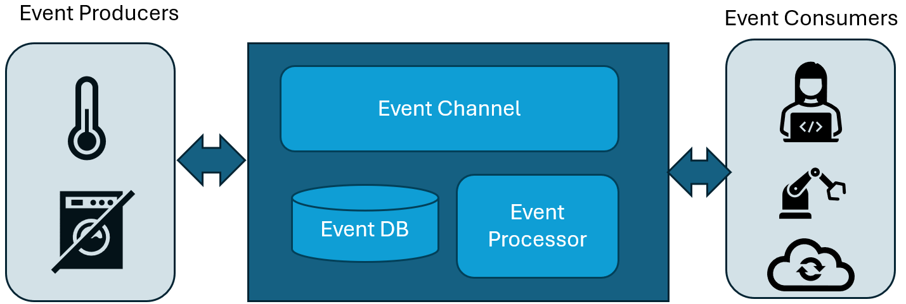
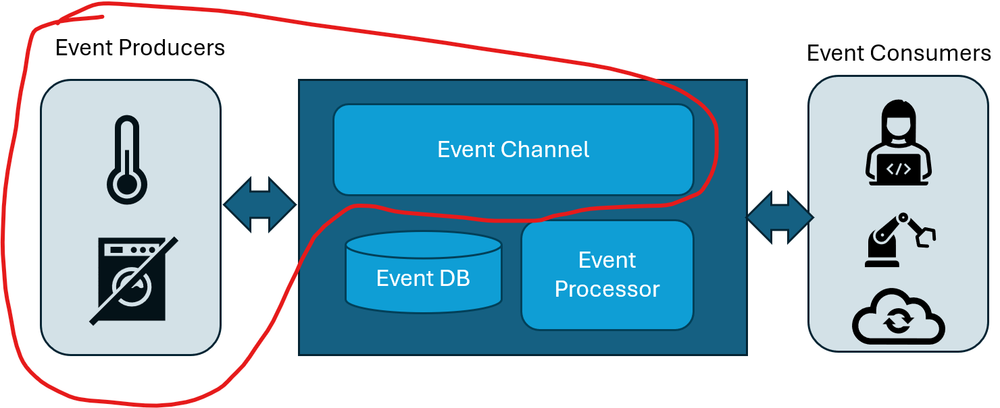
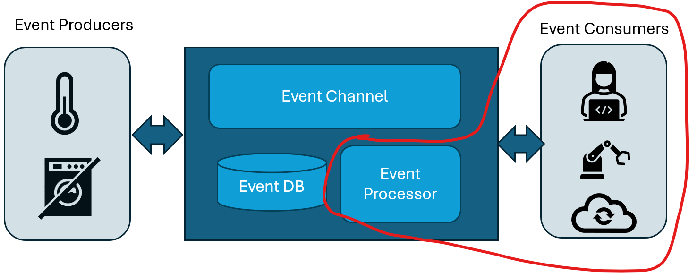

# Event-Driven Architectures in IoT
Introduction to Event-Driven Systems

---

## Context: IoT
- **Internet of Things (IoT)** refers to interconnected devices that collect, share, and act on data.
- Examples:
  - Smart home devices
  - Industrial sensors
  - Wearable health monitors
  
---

## Challenges in IoT Systems
- Large number of devices
- Real-time responsiveness
- Scalability and reliability
- Efficient resource usage

---

## What is Event-Driven Architecture (EDA)?
- **EDA** is a software architecture pattern where actions are driven by events.

- Events represent state changes or signals, e.g.:
  - A temperature sensor exceeding a threshold
  
  - A motion detector detecting movement
  
  - Product Order created
  
    

---

## Key Components of EDA 1
+ **Event Producers**: Event producers are processes or systems that generate events.
  + **Sensors**: Generate events when detecting changes, such as temperature, humidity, motion, or light levels.
  + **Applications**: Send events when a user action occurs, such as clicking a button or making a payment.
  + **Logs or Metrics**: Software systems may produce events for performance monitoring or logging errors.

+ **Event Consumers**: Respond to events 

  + **IoT Applications**: An app controlling a thermostat adjusts heating based on temperature sensor events.

  + **Alerting Systems**: Sends an email or SMS when an event, like high CPU usage, is detected.

---
## Key Components of EDA 2
+ **Event Channels**: Event channels provide Transport, enabling communication between producers and consumers.

+ **Event Processors**: Process and analyse events.

  + **Filtering**: Extracting relevant events from a stream.
  + **Aggregation**: Summarising data over time, like calculating the average temperature.
  + **Transformation**: Converting raw data into a more usable format.

---

## EDA vs Traditional Architectures
| **Traditional**      | **Event-Driven**        |
|-----------------------|-------------------------|
| Request-response model| Event-publish model    |
| High coupling         | Low coupling           |
| Centralised logic     | Distributed logic      |
|||
|||

---

# 

## EDA Benefits:  Asynchronous Communication
Decouples the producer and consumer, allowing them to operate independently. Producers emit events without waiting for consumers to process them, enabling non-blocking communication.

- **Example**: 
  - **E-commerce**: When a customer places an order, the system generates an "Order Placed" event. The payment service processes the payment, the inventory service updates stock levels, and the shipping service prepares for delivery—all independently. If the payment service is delayed, it doesn’t block the inventory or shipping processes.
- **Advantages**:
  - Allows systems to handle tasks independently
  - Improves fault tolerance—if one service fails, others can continue operating.

---

## EDA Benefits: Enables (Kind of) Real-Time Processing
 Events can be processed almost immediately as they occur, enabling systems to react quickly to changes or new information.

- **Example**: 
  - **Fraud Detection**: In a financial application, events like "Large Withdrawal" or "Multiple Logins" are immediately processed by a fraud detection system, flagging suspicious transactions in real time and alerting the user.

- **Advantages**:
  - Delivers timely responses to critical events.
  - Improves the user experience by enabling instant actions like notifications or system adjustments.

---

## EDA Benefits:  Scalabilite
By breaking the system into loosely coupled producers, consumers, and channels, event-driven architectures support scaling. Components can be scaled independently based on demand.

- **Example**: 
  - **Taxi Apps**: A platform like Uber uses event-driven architecture to match customers with drivers. When demand surges, additional instances of services like customer-matching can be added without affecting the overall system.

- **Advantages**:
  - Handles high volumes of events seamlessly.
  - Allows scaling only the necessary components, saving resources.

---

## EDA Benefits: Reduces Latency 
Events are transmitted and processed as they occur. This is especially important in time-sensitive applications.

- **Example**: 
  - **IoT and Smart Homes**: In a smart home system, an event like "Motion Detected" triggers the lights to turn on immediately, ensuring the user isn’t left waiting in the dark.

- **Advantages**:
  - Provides faster responses to real-world events.
  - Improves efficiency and user satisfaction in latency-sensitive systems.

---

## Example: Smart Home System
- **Event**: Motion detected by a sensor.
- **Action**: Turn on lights and notify the user.
- Devices communicate via an event-driven system.

---

## Event-Driven Communication Protocols/Approaches 1
- **MQTT**: We know about this...
- **CoAP (Constrained Application Protocol)** is designed for use in constrained environments
  +  Popular in IoT devices with limited resources like memory, power, and bandwidth 
  Operates over **UDP (User Datagram Protocol)** and is intended for lightweight, machine-to-machine (M2M) communication.
  
  
---
## Event-Driven Communication Protocols/Approaches 2
- **Apache Kafka:** distributed event streaming platform used for high-throughput, scalable, and persistent event processing.
  + enables asyncronous communication between  Microservices
  + processing sensor data for decision-making.
- **Webhooks**: HTTP-based mechanisms for enabling event-driven communication between systems.
  + Thingspeak has then in the Integration section
  
  

---

# EDA Example: Predictive Machine Maintenance

---

## Predictive Maintenance Workflow 1

1. **Event Producers**: 
   Sensors collect data from equipment and send events such as:
   - `Temperature = 100°C`
   - `Vibration = High`

2. **Event Channels**:
   - Sensors publish events to channels like MQTT or Kafka.
   - Channels organise and route events based on topics.

---

## Predictive Maintenance Workflow 2

3. **Event Processors**:

- Processes the incoming raw event data in real-time.
- Aggregates data over time (e.g., averages, spikes).AI/ML models predict equipment failures based on detected trends. Can generate New events(Remember in MQTT, processed can both publish & subscribe)

4. **Event Consumers**:

- Dashboard receives an alert: **"Machine Bearing Failure Predicted in 12 Hours"**.
- Automated system reduces machine load.
- Data stored in the cloud for future analysis.

---

### **Event Producers**

- Sensors and devices attached to industrial equipment that generate events.
- **Examples**:
  - Temperature sensors
  - Vibration sensors
  - Pressure gauges
  - Equipment error logs
- **Output**: Events like `temperature_high`, `vibration_spike`, or `error_log`

---

### **Event Channels**
- **Description**: Responsible for transporting events from producers to processors and consumers.
- **Examples**:
  - MQTT broker
  - Apache Kafka
- **Purpose**:
  - Events mapped to topics (e.g., `machine1/temperature` or `machine1/vibration`).
  - Ensures reliable and efficient data transport.

---

### **Event Processors**
- **Description**: Processes incoming events for analysis and decision-making.
- **Examples**:
  - Stream Processing Systems: Aggregate and filter events in real time.
  - AI/ML Models: Predict failures based on trends and historical data.
- **Output**: Predictions or new actionable events like `maintenance_required`.

---

### **Event Consumers**
- **Description**: Respond to processed events and take appropriate actions.
- **Examples**:
  - Dashboards for maintenance teams.
  - Automated systems to shut down or adjust equipment.
  - Cloud storage for analytics and reporting.
- **Actions Taken**:
  - Alerts sent to maintenance teams.
  - Equipment load reduced to prevent further damage.
  - Data stored for long-term analysis.

---

## Benefits of EDA in IoT
1. Real-time responsiveness.
2. Scalability for millions of devices.
3. Decoupled, modular design.
4. Better fault tolerance.

---

## Challenges of EDA in IoT
- Complexity in event management.
- Ensuring reliability and fault tolerance.
- Managing duplicate or missed events.

---

## EDA with Edge Computing
- Events processed closer to the source (edge devices).
- Reduces latency and bandwidth usage.
- Example:
  - Camera processes motion locally, only sends critical events.

---

## Popular Tools for EDA in IoT
- **Protocols**:
  - MQTT
  - CoAP
  - AMQP
  
- **Platforms**:
  - AWS IoT
  - Azure IoT Hub
  - Google Cloud IoT
  - Blynk
  
  

---
## References

https://www.hivemq.com/blog/iot-event-driven-microservices-architecture-mqtt/

https://www.linkedin.com/pulse/event-driven-architecture-meets-ai-iot-new-era-intelligent-mjtse/

https://www.checkproof.com/predictive-maintenance-using-iot/

https://hazelcast.com/glossary/event-driven-architecture/