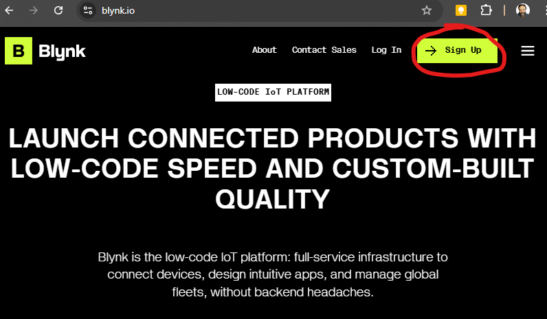
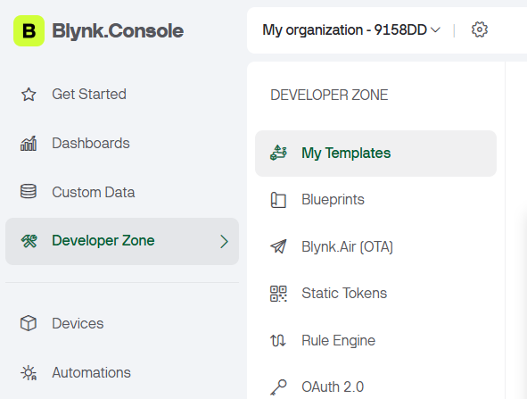

# Create Blynk Account

+ Go to the [Blynk Web Site](https://blynk.io/) and click the "Sign Up" button  and follow the instructions:  
  

+ After creating a password, you should be able to log in. You can take the tour if you like but **you can skip the QuickStart dialog**

+ You should see the **Blynk.Console**.  **Blynk.Console** is a feature-rich web application you use to manage your Blynk devices.    

  
