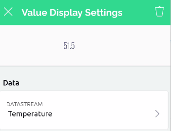
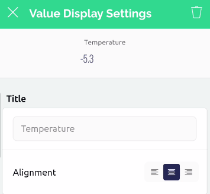
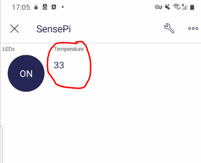

# Get data from the RPi to your phone 

We'll now send data from the RPi  to the Blynk Mobile app. You will need to update the Template we are using for the device. 


### Update Phone App

+ On your phone, open the Blynk app and select the  SensePi device. Click on the wrench in the top-right corner to edit the Mobile Dashboard.
+ Open the *Widget Box*, scroll down to the displays section and  and add a *Value Display* 
  
+ Click on the Value Display widget and configure it to display temperature and  by attaching it to the  Temperature DataStream as shown:
  
+ In the Design tab, set the title to Temperature.



+ Exit back out to the App as before using the back button in top left corner.

### Update Blynk Python program on RPi 

+ Now, on the Raspberry Pi, in ``blynk.py``, add one line of code to write the temperature to virtual pin 0 (V0) and the temperature datastream. The line if code is shown below:

```python
while True:
    blynk.run()
    blynk.virtual_write(0, sense.temperature) #ADD THIS LINE!!!
    time.sleep(1)
```


+ Now run the blynk python app on the RPi as before.

  ### Temperature on Phone

  Now open the the Blynk app on your phone again, you should now see live temperature data. 
  

+ Select the ``Button`` and it should appear on your project


## Exercise:

Referencing the previous steps, try some of the following steps:

+ Display Temperature using a **Gauge** and **SuperChart** widgets. 
+ Display Pressure/Humidity data on the Blynk App
  

**NOTE: Remember to stop the RPI program when you're done so that you so not use up unnecessary messages (you get 30000 on a free account)**
