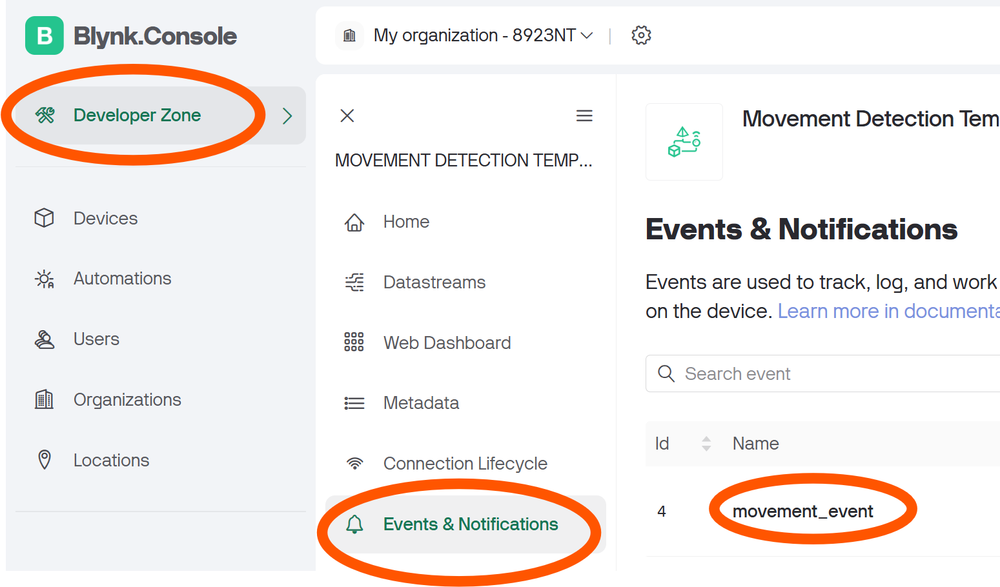
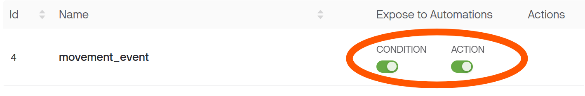
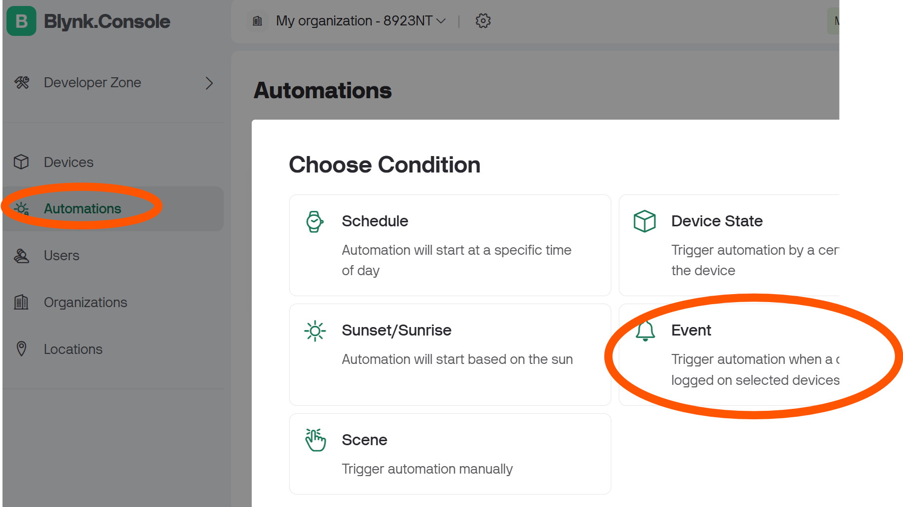
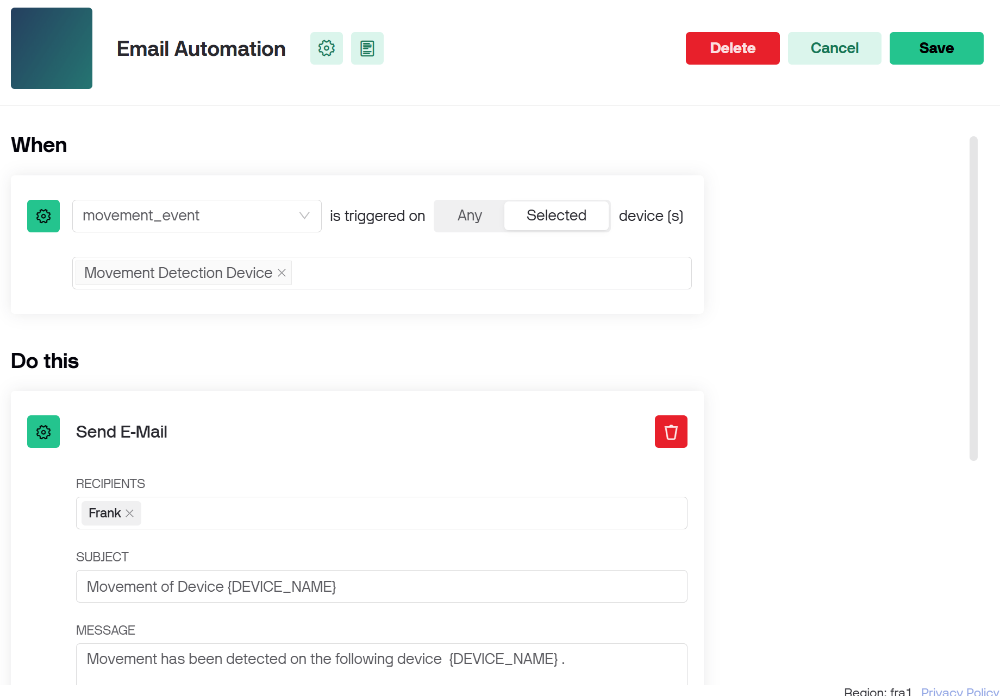
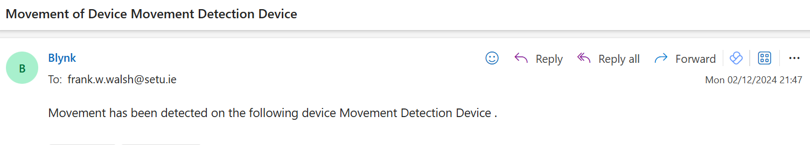

# Automations 

Automations allow you to define one or more **actions** that will automatically execute if a certain **condition** occurs.This pattern is similar to Reacts in Thingspeak.  

In this step, you will Create an automation that creates an email 15 minutes after a movement event occurs

### Expose Event to Automations

+ In the Blynk console, go to Developer Zone-> Templates and select the Movement Template

+ Select Events and Notifications and Click the **Edit** button

  

+ Scroll across and check the Expose to Automations options:
  

+ Click on Save and Apply. 

### Create Automation

+ In the Blynk Console, open the Automations tab and select Event

+ Configure the Automation as shown below: 

  

+ Click **Save** to save the Automation
+ Now test the Automation by generating an Event, either by shaking the Raspberry Pi, or via HTTP request. You should se an email similar to teh following appear in your inbox soon after the Event has occurred.

