# Blink Events and Automations

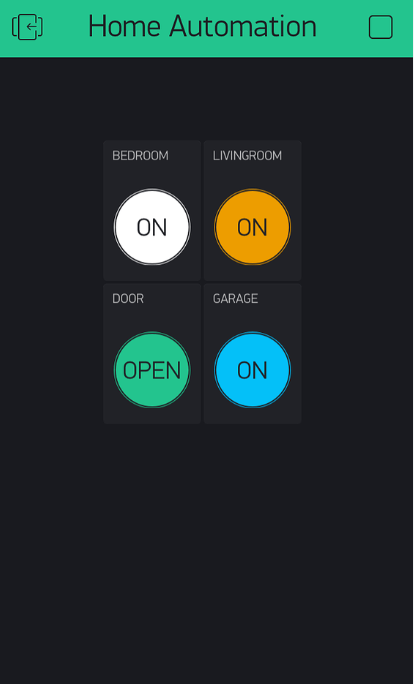

---
## Blynk Events
+ Events are used to track, log, and work with important events. 

+ Events are also used for notifications which can be sent over email,  push notifications, or SMS.

+ Events are pre-configured in Blynk.Console

+ Can be triggered by:

  +  Blynk Library/Firmware from the device 
  + Using the Events HTTP API

  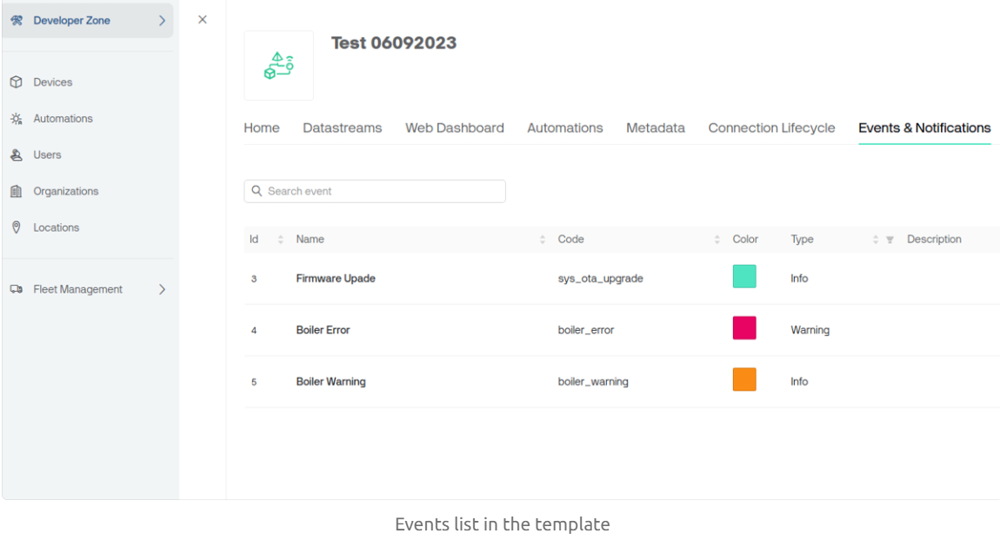
---

## Blynk Event Examples

- Create Warning Event when temperature reaches a certain threshold and send a notification
- Create Error Event status/malfunction of device
- Track the total working hours of the device. Notify tech support to provide maintenance 
- Track online availability of device to comply with Service Level Agreement
- Unexpected Vibrations in Mechanical Device

(From Blynk Website)

---

## Types of Events

There are three types of Events in Blynk: 

- **System Events:** Default Blynk platform events, like "OTA Update"
  - Unable to delete or edit system events. Example: Firmware Over-The-Air Update status
- **Custom Events:** Events you can create and configure for your needs
  - Events are specific to your application or device.
- **Content Events:** Informative events that are shown separately in the app


---

## Event Definition in Blynk

+ Open existing Template or create a new template in Blynk

+ Go to Developer Zone -> My Templates -> Select a template -> Open the "Events & Notifications" tab.

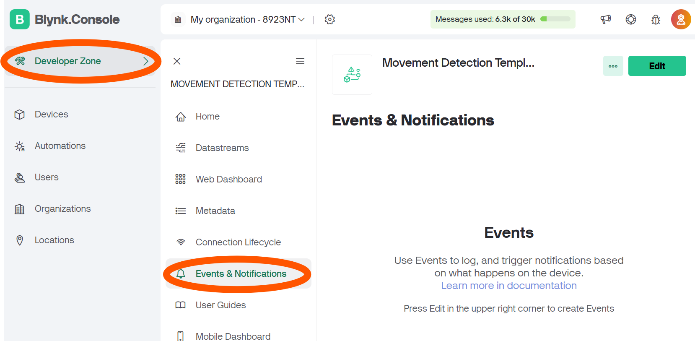


Each event is assigned an `EVENT_CODE`, which is used in the firmware API or HTTPS API.

---

## Configuring Events

+ You need to explicitly configure Event settings :
  + Event frequency limits(every minute/hour etc)
  + Event visibility in Blynk App/console
  + Notification Configurations
  + Automation Access
    + Can it be used to initiate automations

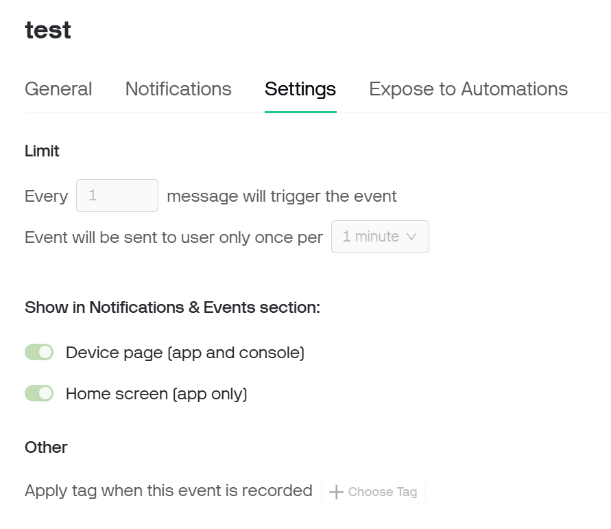

---

## Sending Events Example

Can Send Events using 

1. Blynk Python Library
2. HTTP API


---

### Create Events Using Python library

+ Use the `blynk.logEvent(event_code)`  command to trigger a new event:

```python
if temperature > 35:
   blynk.log_Event("high_temp")
```

+ Executing this code will log the Event .
+ Associated automations will occur (render on the timeline, send notifications, etc.)
+ **WARNING: Don't log an event too many times to avoid hitting daily limits.** 100 events per device per day. 

---

## Setting Custom Event Description

+ It is possible to change the description of the event when it's rendered on the timeline in Blynk.Console and in Blynk.Apps. For example, you can include the current data

```python
if temperature > 35:
  Blynk.logEvent("event_code", f"High TemperatureDetected! {temperature}º")
```


---

### Create Events Using HTTP API

+ Blynk allows access to Events via the Event HTTP API
  + Use the Query String of the URL to specify event code, auth token and optional description
+ Log an event via GET request: 

```
`/external/api/logEvent?token={AuthToken}&code={event_code}
```

+ To add a custom description to the event, use this GET request

```bash
`/external/api/logEvent?token={AuthToken}&code={event_code}&description={event_description}
```


```bash
https://blynk.cloud/external/api/logEvent?token=GadsdadsavsV0YD3el4y0OpneL1&code=firmware_update&description=test
```


---

## Blynk Event using Python Library

```
Blynk.log_Event("event_code", "optional message");
```


```
if some_condition: 
    blynk.log_Event("hello");
}
```

Optionally, you can send a custom description of the event. This description will be rendered on Device Timeline.


```
if (some_condition){
    Blynk.log_event("hello", "Hello World,") ;
}
```


---

## Event Log

+ Blynk Console, click on the Bell icon to open the Notifications & Events console. 

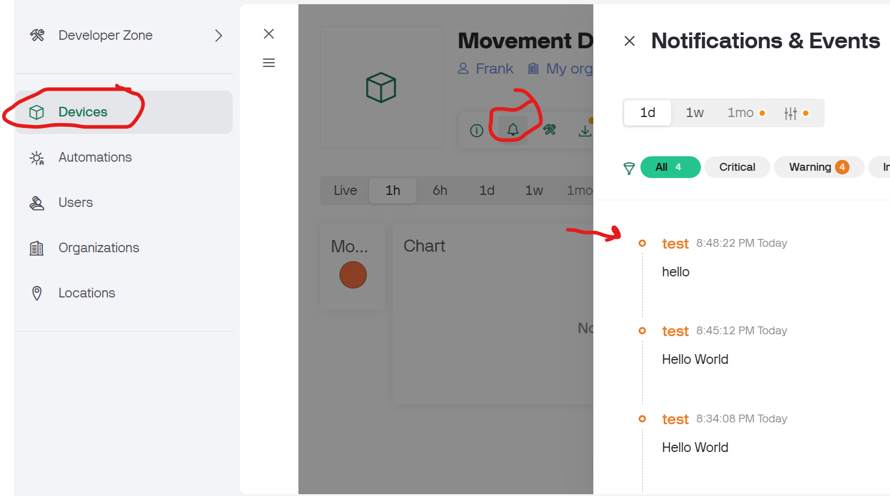

---

## Event Notifications

You can also configure Push Notifications/email/sms to occur on an event:

+ Open Template, go to Events, and enable via Notifications tab

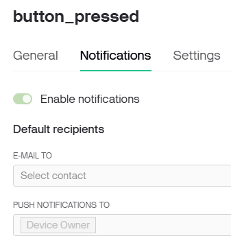

---
## Events Considerations

- You can send only 100 events per device per day
- When the limit is reached you'll see the notification on the UI in the Device Timeline section
- The maximum description length for the event is 300 characters


---
# Blynk Automations
---
## Automations
+ Enables the  creation of scenarios where devices perform specific actions based on defined conditions, enhancing the functionality and responsiveness of IoT solutions. 

+ Automations configured through both the Blynk Console and Blynk App

  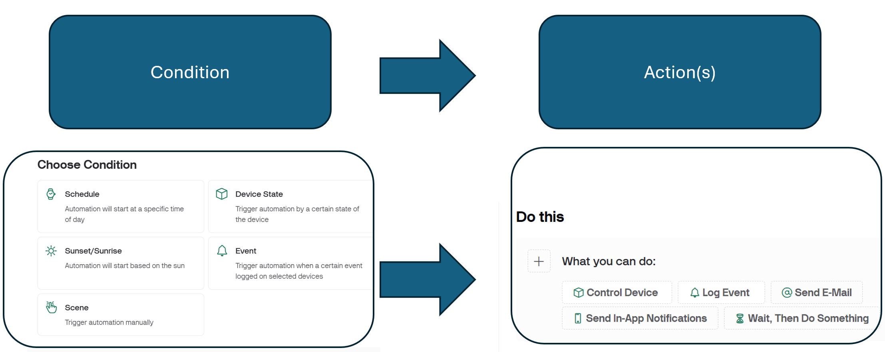
---

## Condition Types


- **Schedule:** Triggers automation at specified dates and times, considering the relevant time zone.
- **Sunrise/Sunset:** Initiates automation relative to sunrise or sunset times on selected weekdays at a specific geographic location.
- **Device State:** Activates automation based on the value of a datastream from a device.  
- **Scene:** Allows manual triggering of automation scenarios directly from the Blynk.App or Blynk.Console.
- **Event** Triggers Automation when a certain event occurs

---

##  Types of actions

One or more actions may be executed when a condition's requirement has been met. Examples:

- **Control Device:** Sets a datastream value for a specific device.
- **Forward Device Data:** Updates a datastream value for one device based on data from another device.
- **Send Email:** Dispatches an email to designated users with optional details about the organization, template, device, and datastream value.
- **Send In-App Notification:** Sends a notification within the Blynk.App to specified users, including optional details.
- **Wait, Then Do Something:** Introduces a delay until a specific time or for a set duration before executing the next action.
- **Send SMS:** Sends a text message to specified users; this option is available only to BUSINESS subscribers.

---

## Why use automations: Interoperability

+ Automations are external to devices.
  + Can work across all devices
+ One condition can be used to perform actions on multiple devices.
+ The value of a Datastream(e.g. temperature) may be used by a condition
+ Automation can be configured to set a Datastream to a new value. 
+ Widgets on the Blynk.Console and/or Blynk.App, you can visualise and change the values of Datastreams. 
+ You may also access Datastreams within the firmware of an IoT device, and by using a HTTP API.

---

# Set Up Automations in Blynk

---

## Prepare Datastreams for use in Automations

+ Go to Blynk.Console ->Templates -> Template -> Datastreams and select the datastream you wish to use

+ Make a choice for the Datastream to be associated with your Automation
 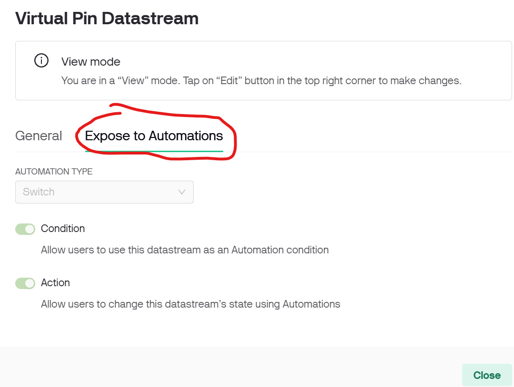 


---
## Prepare Event for use in Automations

+ Go to Blynk.Console ->Templates -> Template -> Events and select the event you wish to use

+ Edit the Event as follows: 
 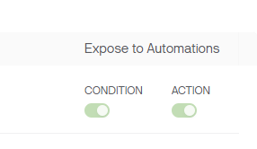 
---

## Create an Automation

+ From the [Blynk.Console](https://docs.blynk.io/en/blynk.console/console-overview), click on the Automations item on the main menu.  

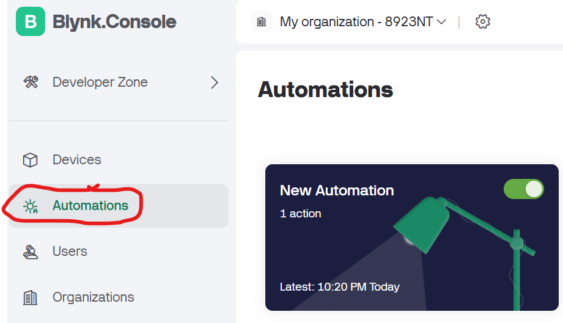

---

## Placeholders

The ‘Send Email’, ‘Send In-App Notifications’, and ‘Send SMS’ actions support the use of placeholders. Placeholders are key/value pairs that refer to Blynk account metadata and [Datastream](https://docs.blynk.io/en/getting-started/template-quick-setup/set-up-datastreams) values.

- **{ORG_NAME}** - name of the organization the device is assigned to. 
- **{PRODUCT_NAME}** - name of the Template used. 
- **{DEVICE_NAME}** - the IoT Device name as displayed under ‘DEVICES’.
- **{TRIGGER_VALUE}** - if a Device State trigger was used, this will be the value of the trigger.


---

### Configuring a Device State Condition

+ The condition (When) option of ‘Device State’ triggers an action based on the value of a datastream.
+ After selecting the ‘Device State’ option, you need to specify the device, then the datastream, and finally what type of datastream value change to monitor from the dropdown lists.

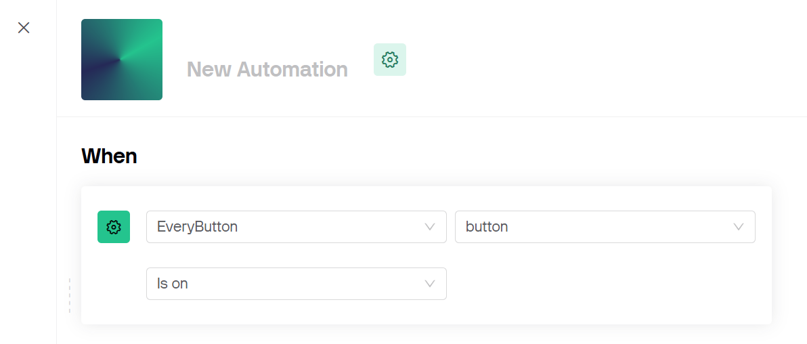


---


## Automation Management

After the Automation is configured, it will appear in the 'Automations' list as a card, with the count of actions defined, and the last date/time that the Automation was executed. A switch on the card allows the Automation to be enabled/disabled.

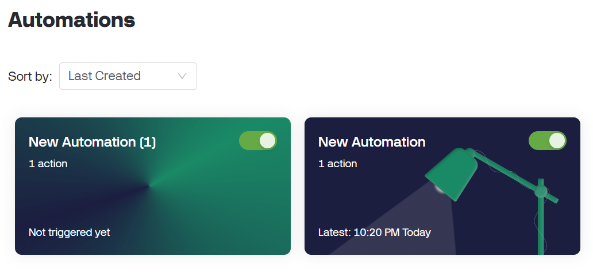

---

### Automations Logs

In the [Blynk.Console](https://docs.blynk.io/en/blynk.console/console-overview), you may also view the Automation Logs while editing an Automation.  This option is not available in the [Blynk.App](https://docs.blynk.io/en/blynk.apps/overview).

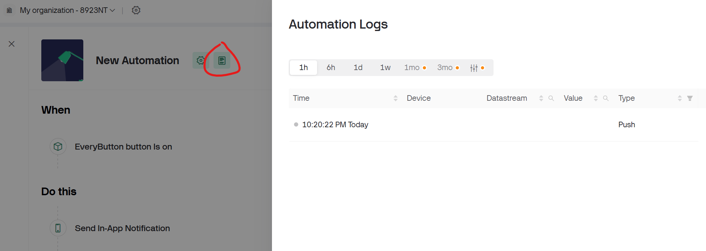

Selecting the ‘Automation Logs’ icon will display a page with a history of the executions of the Automation.  The summary includes the date/time when it was executed, from what [Device](https://docs.blynk.io/en/concepts/device), the Datastream employed, and the value of the [Datastream](https://docs.blynk.io/en/getting-started/template-quick-setup/set-up-datastreams).

---
