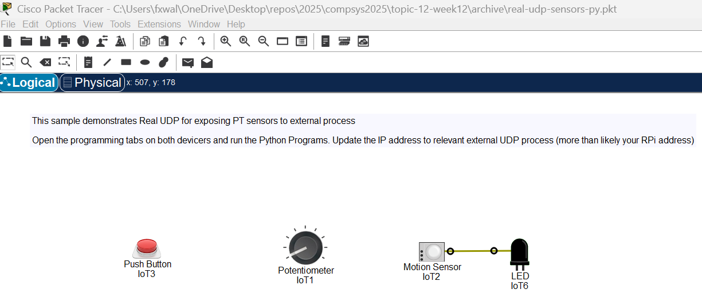
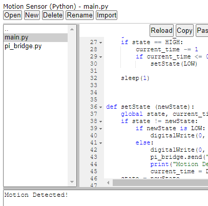
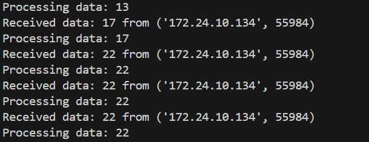

## Example Set Up

In this exercise you will develop the following general design that can be applied to more specific use cases: 


### Raspberry Pi Set Up:

+ Connect to your Raspberry Pi as you usually do (Secure Shell or otherwise) and open a command line interface

+ Create a new folder in your home folder called **week12-example** and a new Virtual Envirionment:

  - ```
    mkdir ~/week12-example/
    cd ~/week12-example/
    python -m venv .venv --system-site-packages
    ```

  - Activate the venv:

    ```
    source .venv/bin/activate
    ```

  

+ In this folder, create a file called ***sensor_listener.py*** with the following code:

~~~python
import socket
import threading

class SensorListener:
    def __init__(self, host='0.0.0.0', port=5000, buffer_size=1024):
        #Initialise the UDP Listener.
        self.host = host
        self.port = port
        self.buffer_size = buffer_size
        self.running = False
        self.callback = None

    def start(self):      
        #Start in a separate thread.
        self.running = True
        threading.Thread(target=self._listen, daemon=True).start()

    def stop(self):
        #Stop the UDP listener.
        self.running = False

    def _listen(self):
        #Internal method to listen for UDP packets and handle them.
        with socket.socket(socket.AF_INET, socket.SOCK_DGRAM) as server:
            server.bind((self.host, self.port))
            print(f"UDP Listener started on {self.host}:{self.port}")
            while self.running:
                try:
                    data, address = server.recvfrom(self.buffer_size)
                    print(f"Received data: {data.decode()} from {address}")
                    if self.callback:
                        self.callback(data.decode())
                except Exception as e:
                    print(f"Error receiving data: {e}")
            print("UDP Listener stopped.")

if __name__ == "__main__":
    # Example usage
    def handle_data(data):
        print(f"Processing data: {data}")

    listener = SensorListener(port=5000)
    listener.callback=handle_data
    listener.start()

    try:
        while True:
            pass  # Keep the main thread alive
    except KeyboardInterrupt:
        listener.stop()
~~~

The above program has features we have not covered but that's ok for now - we just want to use it as a utility in our application. The program defines a `SensorListener` class that listens for UDP packets on the host it is running on. It processes received UDP packets using the callback function. A feature of the program is its use of threading to handle UDP communication. Threading means that the `_listen` method runs independently of the main program thread. This prevents the main program from being blocked by the continuous listening loop in `_listen`.

+ Run the program at the command line using ``python sensor_listener.py``. 

```   
~/week12-example $ python sensor_listener.py
UDP Listener started on 0.0.0.0:5000
```

+ Leave this process running for the next step. 

#### Packet Tracer Set Up: 

The following PT file demonstrates Real UDP for exposing PT sensors to external processes. We can modify it to send UDP datagrams to the 


+ **Do the following on your Laptop/workstation where you have Packet Tracer installed**
+ Download the following Packet Tracer simulation.  
  [Real UDP PT File](https://setu-hdip-comp-sci-2024-comp-sys.netlify.app/topic-12-week12/archive/archive.zip)
  You should see the following: 
  

+ Double click on the **Push Button** to configure it. Select the Advanced button and open the Programming tab. 


+ In the Projects list, double click the Push Button project to open(it may be open by default. If so, you'll see the pi_bridge.py script...)
+ Select the ***pi_bridge.py*** script to show the code. Update the IP variable to be the **IP address of the device running the sensor_listener.py script from the last step (i.e. your Raspberry Pi)** 


+ To make the IP change take effect, restart the project by clicking **stop** and then **start**. 


#### Testing 

+ In Packet Tracer, simultaneously press the Alt key and move your mouse pointer across the Motion sensor. You should see the Motion Detected message appear in Packet Tracer program output and the RPi console: 



~~~bash
(.venv)~/week12-example $ python sensor_listener.py
UDP Listener started on 0.0.0.0:5000
Received data: true from ('172.24.10.134', 62592)
Processing data: true
Received data: false from ('172.24.10.134', 62592)
Processing data: false

~~~

You now have Sensing in Packet Tracer connected to the RPi. 

### Potentiometer

+ Similar to above, double click on the Potentiometer to configure it. Select the Advanced button and open the Programming tab.

+ In the Projects list, double click the RFID Reader project to open .

+ Select the ***pi_bridge.py*** script to show the code. Update the IP variable to be the **IP address of the device running the sensor_listener.py script from the last step (i.e. your Raspberry Pi)**.

+ To make the IP change take effect, restart the project by clicking **Stop** and then **Start**. 

+ Once set up move/drag the RFID card to the card reader and it will send the Card ID to the RPi: 

  uiJK
