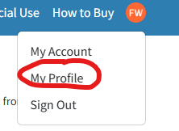
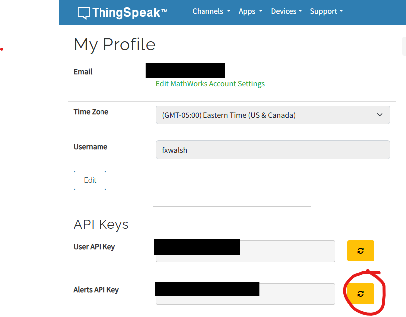
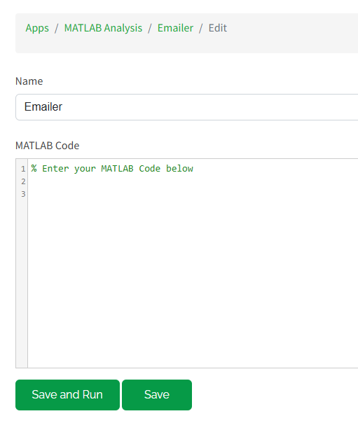
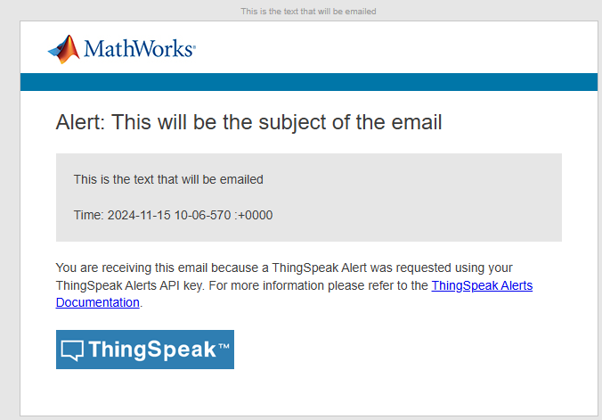
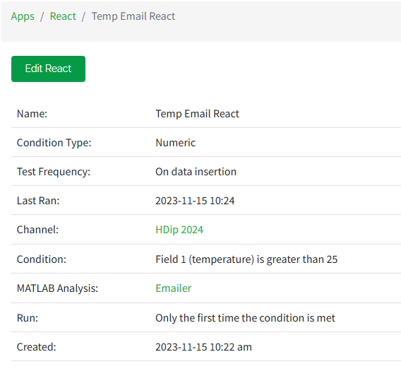

# Automatic Email using Thingspeak Apps

In this step you will use Thingspeak Apps  to trigger an email. You will:

+ Use a MATLAB Analysis App to send an email to your email account( the one you used to register with THingspeak.)
+ Use a React App to trigger the email App

This uses the Thingspeak  [Alerts API](https://uk.mathworks.com/help/thingspeak/alerts-api.html) to send emails to your ThingSpea account address based on ThingSpeak data, or to trigger an email from a device.

### Generate an Alerts API Key

You will need to create an API key on the **Account** > **My Profile** page.

+ In Thingspeak, go to **Account** > **My Profile**. 

+ Click the **Generate New API Key** button to generate an API key. 
  

  The alerts API key will start with ‘TAK’. You will need this in the next step. 

### MATLAB Analysis to Send Email

+  Create a new MATLAB analysis at Apps > MATLAB Analysis. Click the New button on the top. Choose the blank option and enter Emailer as the name:

    

+  Enter the following into the code window, **replacing YOUR_ALERT_API_KEY with the alerts key from the last step.**

  ~~~matlab
  alert_body = 'This is the text that will be emailed';
  alert_subject = 'This will be the subject of the email';
  alert_api_key = 'YOUR_ALERT_API_KEY';
  alert_url= "https://api.thingspeak.com/alerts/send";
  jsonmessage = sprintf(['{"subject": "%s", "body": "%s"}'], alert_subject,alert_body);
  options = weboptions("HeaderFields", {'Thingspeak-Alerts-API-Key', alert_api_key; 'Content-Type','application/json'});
  result = webwrite(alert_url, jsonmessage, options);
  ~~~

+   Click ***Save and Run*** to test if it works . Check your email inbox - you should see the following: 

     

   

## Create a React App

Create a React app to trigger the ThingHTTP based on your channel data. 

The React app can evaluate your ThingSpeak channel data and trigger other events. Create an instance of the React app that triggers when the SensePi reports temperature greater than 30 degrees(Too Hot). 

+ In Thingspeak in your channel, choose *Apps > React*, and then click New React and fill out as follows. **Make sure you select  "Only the first time the condition is met" option**. Otherwise, you could get alot of emails!:
  
  

Once the temperature in the channel reaches the set point for your React, you'll receive an email. It will only happen the first time the condition is met.

## Testing

You can test each component separately.

1.  Trigger your React App by writing data to your channel that fits the conditions specified in your React(just like you did in the last step). For example, you can write a temperature of 49 degrees to field 1.

GET https://api.thingspeak.com/apps/thinghttp/send_request?api_key=XXXXXXXXXXXXXXXX&field1=49

Remember, **the api_key in the above URL here is your Api Write key** you used in the Create Channel step, not the Alet Key used for sending email email.
