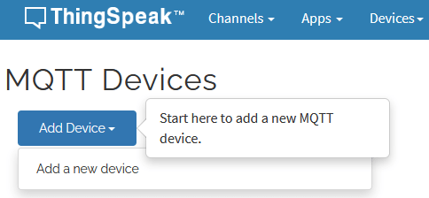

# Connect Raspberry Pi to Thingspeak MQTT

ThingSpeak enables clients to update and receive updates from channel feeds via the **ThingSpeak MQTT broker**. As in the last lab, you can connect your Raspberry Pi to the MQTT broker and can publish to a ThingSpeak channel or subscribe to updates from that channel.


### Create a ThingSpeak MQTT Device

MQTT access to your channel, including credentials, is handled by a ThingSpeak MQTT device. Your device is configured with the credentials necessary for your MQTT client, in this case your Raspberry Pi,  to communicate with ThingSpeak, and for authorizing specific channels. Create an MQTT device for your Raspberry Pi as follows.

+ In the ThingSpeak menu click **Devices** > **MQTT**.  


+ On the MQTT Devices page, click **Add Device** > **Add a new device**.  



+ Fill in the *Add a new device* dialog as follows:

+ Enter Name and Description as shown below. In Authorize Channels to access, select **"SensePi**" and click **"Add Channel"**   followed by **"Add Device**":

]

+ ThingSpeak will now generates a list of credentials for your device that includes client ID, username, and password. 

+ Click **Download Credentials**, select the **Plain Text** option,  and save the credentials in a local file. **Important: Record or save your credentials now, as you will not get another opportunity to view or save the password.**


+ Click **Done** to complete the device creation.

## Write Temperature Data From Raspberry Pi

#### Set environment variables on the Raspberry Pi

On the Raspberry Pi, open a terminal and run. 

Create filr  `set_thingspeak_env.sh` and edit to be similar to the following(use the values from the downloaded credentials and Thingspeak channel ID):

```
#!/usr/bin/env bash

export THINGSPEAK_USERNAME="LwogBrFyDd4lKhEkORo8AAA"
export THINGSPEAK_CLIENT_ID="LwogBrFyDd4lKhEkORo8AAA"
export THINGSPEAK_PASSWORD="7c+vxaw3CVLredzEsheaHy7B"
export THINGSPEAK_CHANNEL_ID="1319831"
export TRANSMISSION_INTERVAL="15"

echo "ThingSpeak environment variables set for this shell."
```

Make it executable:

```
chmod +x set_thingspeak_env.sh
```

Run it (important: use `source` or `.`):

```
source ./set_thingspeak_env.sh
# or
. ./set_thingspeak_env.sh
```

> These will apply **only to the current terminal session**.

### Python Script

. We will also use logging to improve debugging: 

+ Install dot_env using pip

  ```bash
  pip install paho-mqtt
  ```

  

+ In week11-lab2, create a new file called *thingspeak-pub.py* and insert the following code: 

~~~python
#!/usr/bin/python3

import os
import sys
import time
import logging
from urllib.parse import urlparse

import paho.mqtt.client as mqtt
from sense_hat import SenseHat

# configure Logging
logging.basicConfig(level=logging.INFO)

# Initialise SenseHAT
sense = SenseHat()
sense.clear()

# Load MQTT configuration values from environment variables
USERNAME = os.getenv("THINGSPEAK_USERNAME")
CLIENT_ID = os.getenv("THINGSPEAK_CLIENT_ID")
PASSWORD = os.getenv("THINGSPEAK_PASSWORD")
CHANNEL_ID = os.getenv("THINGSPEAK_CHANNEL_ID")
TRANSMISSION_INTERVAL = int(os.getenv("TRANSMISSION_INTERVAL", "15"))

# Define event callbacks for MQTT
def on_connect(client, userdata, flags, rc):
    logging.info("Connection Result: %s", rc)

def on_publish(client, obj, mid):
    logging.info("Message Sent ID: %s", mid)

mqttc = mqtt.Client(client_id=CLIENT_ID)
mqttc.on_connect = on_connect
mqttc.on_publish = on_publish

# parse mqtt url for connection details
url_str = sys.argv[1]
url = urlparse(url_str)

# Configure MQTT client with user name and password
mqttc.username_pw_set(USERNAME, PASSWORD)

# Connect to MQTT Broker
mqttc.connect(url.hostname, url.port)
mqttc.loop_start()

# Set Thingspeak Channel to publish to
topic = f"channels/{CHANNEL_ID}/publish"

# Publish a message every TRANSMISSION_INTERVAL seconds
while True:
    try:
        temp = round(sense.get_temperature(), 2)
        payload = "field1=" + str(temp)
        mqttc.publish(topic, payload)
        time.sleep(TRANSMISSION_INTERVAL)
    except KeyboardInterrupt:
        logging.info("Interrupted")
        break
    except Exception as e:
        logging.exception("Error: %s", e)
        time.sleep(2)
~~~

- Run the script by typing ``python thingspeak-pub.py mqtt://mqtt3.thingspeak.com:1883``. You should see data appear in the channel as before. 

## Testing

This time, it's real sensor data. You can perform a rudimentary test by altering the threshold value in the *React* app to be approximately about 0.5C the current temp returned by the sensor. Then, lightly blow on the SenseHAT to reduce the Temperature temporarily. When it rises again it should trigger the React!

Alternatively, you can still use Postman or your Browser to write data to the channel.

